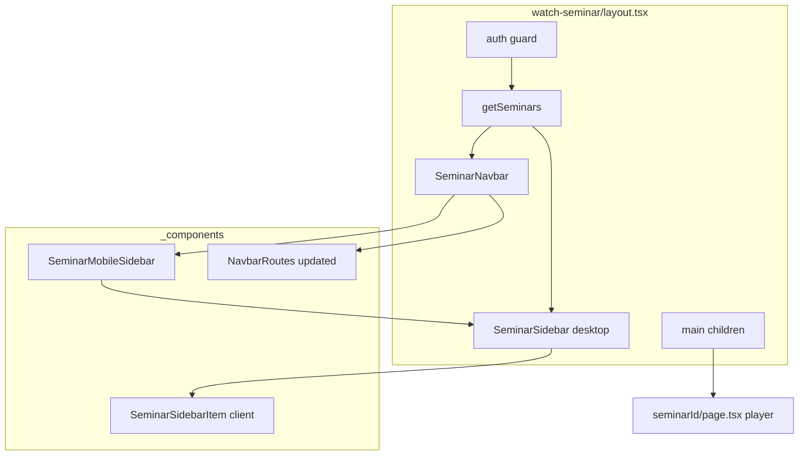

# Seminar watch page layout

## Current state

| Area | Course watch | Seminar watch (today) |
|------|--------------|------------------------|
| Layout | [`app/(course)/watch-course/[courseId]/layout.tsx`](app/(course)/watch-course/[courseId]/layout.tsx) | None |
| Navbar | `CourseNavbar` + `NavbarRoutes` back button | None |
| Sidebar | `CourseSidebar` (chapters for this course) | None |
| Page | Chapter player in `main` | Bare centered column in [`app/(course)/watch-seminar/[seminarId]/page.tsx`](app/(course)/watch-seminar/[seminarId]/page.tsx) |

The course shell pattern to mirror:

```48:57:app/(course)/watch-course/[courseId]/layout.tsx
    return (
        <div className="h-full">
            <div className="h-[80px] md:pl-80 fixed inset-y-0 w-full z-50">
                <CourseNavbar course={course} progressCount={progressCount} />
            </div>
            <div className="hidden md:flex h-full w-80 flex-col fixed inset-y-0 z-50">
                <CourseSidebar course={course} progressCount={progressCount} />
            </div>
            <main className="md:pl-80 h-full pt-[80px]">{children}</main>
        </div>
    );
```

Seminars differ in one key way: the sidebar list is **global** (all published seminars), not scoped to a parent entity. Reuse [`actions/get-seminars.ts`](actions/get-seminars.ts) — no progress, locks, or purchase checks.

## Architecture



## Implementation

### 1. New layout — [`app/(course)/watch-seminar/layout.tsx`](app/(course)/watch-seminar/layout.tsx)

- Async server component, same shell classes as course layout (`h-[80px]`, `w-80`, `md:pl-80`, `pt-[80px]`).
- Auth: redirect unauthenticated users to `/` (preserve current page behavior).
- Data: `const seminars = await getSeminars({})`.
- Render `SeminarNavbar`, desktop `SeminarSidebar`, and `{children}` in `main`.
- No `seminarId` param needed in layout — active item is resolved client-side from pathname.

### 2. New components under [`app/(course)/watch-seminar/_components/`](app/(course)/watch-seminar/_components/)

Mirror the course file split:

| File | Based on | Notes |
|------|----------|-------|
| `seminar-navbar.tsx` | [`course-navbar.tsx`](app/(course)/watch-course/[courseId]/_components/course-navbar.tsx) | `SeminarMobileSidebar` + `NavbarRoutes` |
| `seminar-mobile-sidebar.tsx` | [`course-mobile-sidebar.tsx`](app/(course)/watch-course/[courseId]/_components/course-mobile-sidebar.tsx) | Sheet wrapping `SeminarSidebar` |
| `seminar-sidebar.tsx` | [`course-sidebar.tsx`](app/(course)/watch-course/[courseId]/_components/course-sidebar.tsx) | Simpler: header + list only |
| `seminar-sidebar-item.tsx` | [`course-siderbar-item.tsx`](app/(course)/watch-course/[courseId]/_components/course-siderbar-item.tsx) | Simpler: no lock/completion |

**SeminarSidebar header:** use existing `language.sidebar.seminars` label (e.g. "Seminars") instead of a single seminar title — parallel to course sidebar showing the course name above its chapter list.

**SeminarSidebarItem (client):**
- Props: `id`, `label`
- Active: `pathname?.includes(id)` (same as course)
- Navigate: `router.push(\`/${language.seminars.watchSeminarURL}/${id}\`)` — matches [`components/seminar-card.tsx`](components/seminar-card.tsx)
- Icon: always `PlayCircle` (no lock/progress for v1)
- Same button styling/classes as `CourseSidebarItem`

### 3. Navbar back button — [`components/navbar-routes.tsx`](components/navbar-routes.tsx)

Add seminar route detection alongside the existing course check:

```tsx
const isSeminarPage = pathname?.includes(`/${language.seminars.watchSeminarURL}/`);
```

Show back button when `isSeminarPage` (or keep grouped with course/teacher if preferred):
- Link: `/seminars` (internal path; rewrites handle PT `/seminarios`)
- Label: new i18n key `navbar.goBackToSeminars`

Update all four language files + [`languages/language.d.ts`](languages/language.d.ts):
- EN: "Go Back to Seminars"
- PT: "Voltar para Seminários"
- ES/FR: equivalent translations

### 4. Page tweak — [`app/(course)/watch-seminar/[seminarId]/page.tsx`](app/(course)/watch-seminar/[seminarId]/page.tsx)

- Keep `getSeminar` fetch and redirect logic (page still owns playback access).
- Remove redundant auth redirect if moved to layout (layout runs first — keep auth in one place only).
- Align content wrapper with chapter page: `max-w-4xl mx-auto pb-20` with `p-4` on player section (chapter page uses this inside `main`).

No changes to [`video-player.tsx`](app/(course)/watch-seminar/[seminarId]/_components/video-player.tsx).

## Out of scope (v1)

- Progress tracking / completion icons in sidebar
- Lock states (seminars are free for logged-in users)
- Teacher preview of **unpublished** seminars in sidebar list (`getSeminars` is published-only; teacher can still watch via direct URL, but unpublished item won't appear in list)
- New server action — `getSeminars` is sufficient
- E2E tests (none exist for seminar watch today; manual verification only unless you want tests added)

## Verification

1. Log in as student → open a seminar from `/seminars`
2. Confirm navbar: hamburger (mobile), back button → `/seminars`, `UserButton`
3. Confirm sidebar lists all published seminars; current seminar highlighted
4. Click another seminar in sidebar → navigates and updates player
5. Desktop: fixed 320px sidebar; content offset with `md:pl-80`
6. Mobile: sidebar in sheet via menu icon
7. PT locale: sidebar links and back button work with rewritten URLs (`/assistir-seminario/:id`, `/seminarios`)
8. Unauthenticated visit to `/watch-seminar/:id` → redirect `/`

**Checks to run:** `npm run lint`, `npm run build` (or project equivalent).

## Files touched (summary)

**New (5):**
- `app/(course)/watch-seminar/layout.tsx`
- `app/(course)/watch-seminar/_components/seminar-navbar.tsx`
- `app/(course)/watch-seminar/_components/seminar-mobile-sidebar.tsx`
- `app/(course)/watch-seminar/_components/seminar-sidebar.tsx`
- `app/(course)/watch-seminar/_components/seminar-sidebar-item.tsx`

**Modified (6):**
- `components/navbar-routes.tsx`
- `app/(course)/watch-seminar/[seminarId]/page.tsx`
- `languages/language.d.ts`, `english.tsx`, `portuguese.tsx`, `spanish.tsx`, `french.tsx`
