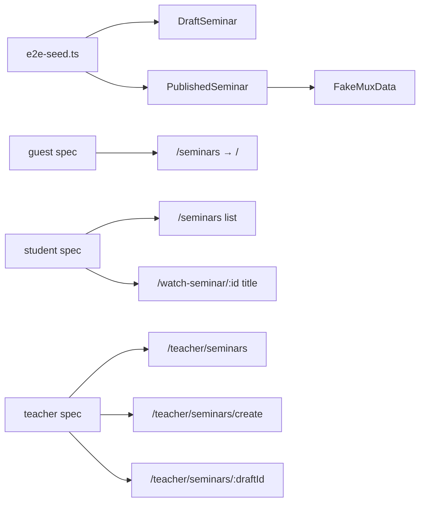

# Seminar E2E Tests

## Context

- Existing E2E suite: 3 Playwright specs under [`e2e/`](e2e/), no unit-test runner.
- Seminar fixtures are **partially wired**: [`e2e/constants.ts`](e2e/constants.ts) defines `E2E_PUBLISHED_SEMINAR` and `E2E_DRAFT_SEMINAR`, but [`scripts/e2e-seed.ts`](scripts/e2e-seed.ts) only upserts the **draft**.
- **Auth gates** (confirmed): [`app/(root)/(routes)/seminars/page.tsx`](app/(root)/(routes)/seminars/page.tsx) and [`app/(course)/watch-seminar/layout.tsx`](app/(course)/watch-seminar/layout.tsx) redirect unauthenticated users to `/`. Guest coverage = redirect test only; catalog + watch = **student** project.
- **Watch page requires MuxData**: [`app/(course)/watch-seminar/[seminarId]/page.tsx`](app/(course)/watch-seminar/[seminarId]/page.tsx) redirects to `/seminars` when `!muxData?.playbackId`. Unlike course chapters (title renders without Mux), seminar watch **must** seed a fake `playbackId` — no real Mux asset or playback assertion (same deferred scope as [`e2e/README.md`](e2e/README.md)).



## 1. Extend E2E constants

**File:** [`e2e/constants.ts`](e2e/constants.ts)

Add stable Mux fixture IDs alongside existing seminar IDs:

```ts
export const E2E_MUX_IDS = {
  publishedSeminar: "e2e000000000000000000040",
} as const;

export const E2E_PUBLISHED_SEMINAR_MUX = {
  assetId: "e2e-seminar-mux-asset",
  playbackId: "e2e-seminar-playback",
} as const;
```

Extend `E2E_PUBLISHED_SEMINAR` with fields needed for a complete published row:

- `videoUrl: "https://example.com/e2e-seminar-video.mp4"` (placeholder; publish gate satisfied)
- `isPublished: true` (implicit in seed, not necessarily in constant)

Existing helpers `watchSeminarPath()` and `teacherSeminarSetupPath()` are already sufficient.

## 2. Extend E2E seed

**File:** [`scripts/e2e-seed.ts`](scripts/e2e-seed.ts)

Refactor `seedSeminar` into two functions mirroring the course pattern:

| Function | Upserts | Fields |
|---|---|---|
| `seedDraftSeminar(teacherId)` | `E2E_DRAFT_SEMINAR` | title, description, imageUrl, `isPublished: false`, no video/mux |
| `seedPublishedSeminar(teacherId)` | `E2E_PUBLISHED_SEMINAR` | all text + image + videoUrl, `isPublished: true`, then nested `muxData` upsert |

Mux upsert (after seminar):

```ts
await database.muxData.upsert({
  where: { id: E2E_MUX_IDS.publishedSeminar },
  create: {
    id: E2E_MUX_IDS.publishedSeminar,
    seminarId: E2E_PUBLISHED_SEMINAR.id,
    assetId: E2E_PUBLISHED_SEMINAR_MUX.assetId,
    playbackId: E2E_PUBLISHED_SEMINAR_MUX.playbackId,
  },
  update: { /* same fields */ },
});
```

Call both from `main()` and extend the completion log with `publishedSeminar`.

**No real Mux API calls** — fake IDs only; aligns with course seed ("no real Mux").

## 3. Guest spec — auth redirect

**File:** [`e2e/guest/catalog.spec.ts`](e2e/guest/catalog.spec.ts)

Add one test alongside existing redirect tests:

- `test("seminars page redirects unauthenticated users away")` → `page.goto("/seminars")` → `expect(page).toHaveURL("/")`

## 4. Student spec — catalog + watch

**New file:** [`e2e/student/seminars.spec.ts`](e2e/student/seminars.spec.ts)

Follow patterns from [`e2e/student/learning.spec.ts`](e2e/student/learning.spec.ts): role-based selectors, English copy, constants imports.

| Test | Assertion |
|---|---|
| Published seminar on catalog | `goto("/seminars")` → `getByRole("link", { name: E2E_PUBLISHED_SEMINAR.title })` visible |
| Draft hidden from catalog | same page → `getByText(E2E_DRAFT_SEMINAR.title)` count 0 |
| Watch page renders title | `goto(watchSeminarPath(E2E_PUBLISHED_SEMINAR.id))` → `getByRole("heading", { name: E2E_PUBLISHED_SEMINAR.title, level: 1 })` visible |

**Not in scope:** Mux player load/play, sidebar navigation clicks, search filter.

## 5. Teacher spec — list, create, setup

**New file:** [`e2e/teacher/seminars.spec.ts`](e2e/teacher/seminars.spec.ts)

Mirror [`e2e/teacher/access.spec.ts`](e2e/teacher/access.spec.ts) structure.

| Test | Assertion |
|---|---|
| Seminars page lists seeded seminars | `goto("/teacher/seminars")` → both `E2E_PUBLISHED_SEMINAR.title` and `E2E_DRAFT_SEMINAR.title` visible |
| Create form renders | `goto("/teacher/seminars/create")` → heading `"Name Your Seminar"`, label `"Seminar Title"`, button `"Continue"` |
| Draft setup form renders | `goto(teacherSeminarSetupPath(E2E_DRAFT_SEMINAR.id))` → heading `"Seminar Setup"`, draft title text visible, unpublished banner `"This seminar is unpublished..."` |

Import `teacherSeminarSetupPath` from constants.

## 6. Update E2E README

**File:** [`e2e/README.md`](e2e/README.md)

- Add new spec files to project structure tree
- Document seminar coverage under "Current test coverage (P0)" for guest/student/teacher
- Note published seminar + fake MuxData in seed description
- Keep Mux playback in "Deferred scope" table

## Verification

Run locally (requires `.env.test`):

```bash
npm run db:e2e:reset          # confirm seed upserts both seminars + mux row
npm run test:e2e -- --project=guest e2e/guest/catalog.spec.ts
npm run test:e2e -- --project=student e2e/student/seminars.spec.ts
npm run test:e2e -- --project=teacher e2e/teacher/seminars.spec.ts
npm run test:e2e                # full suite regression
```

**Verification not performed until implementation:** full CI run, manual Mux player smoke.

## Risks

| Risk | Mitigation |
|---|---|
| Fake `playbackId` causes MuxPlayer runtime errors | Assert title heading only; no player interaction (same as chapter tests) |
| Flaky watch page if redirect fires | Seed must set `playbackId` before tests run; verify with `db:e2e:reset` |
| Teacher table may not expose title as link text | Use `getByText(title)` like courses spec, not role link |

## Files changed (summary)

| File | Change |
|---|---|
| [`e2e/constants.ts`](e2e/constants.ts) | Mux fixture constants |
| [`scripts/e2e-seed.ts`](scripts/e2e-seed.ts) | Published seminar + MuxData seed |
| [`e2e/guest/catalog.spec.ts`](e2e/guest/catalog.spec.ts) | +1 redirect test |
| [`e2e/student/seminars.spec.ts`](e2e/student/seminars.spec.ts) | **new** — 3 tests |
| [`e2e/teacher/seminars.spec.ts`](e2e/teacher/seminars.spec.ts) | **new** — 3 tests |
| [`e2e/README.md`](e2e/README.md) | Coverage docs |

No Playwright config changes needed — `testMatch: /student\/.*\.spec\.ts/` and `teacher\/.*\.spec\.ts/` already pick up new files.
