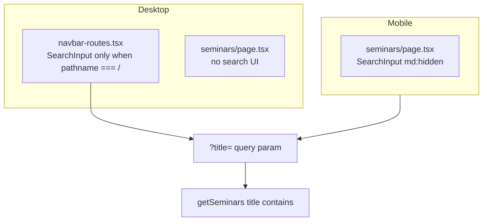

# Add desktop search on `/seminars`

## Current behavior



- [`app/(root)/(routes)/seminars/page.tsx`](app/(root)/(routes)/seminars/page.tsx) renders `SearchInput` inside a `md:hidden` wrapper (mobile only).
- [`components/navbar-routes.tsx`](components/navbar-routes.tsx) renders desktop search (`hidden md:block`) only when `pathname === "/"`.
- [`actions/get-seminars.ts`](actions/get-seminars.ts) already filters published seminars by `title` via the `?title=` query param — no backend work required.
- [`components/search-input.tsx`](components/search-input.tsx) is path-aware: it pushes `title` onto the current `pathname`, so it works on `/seminars` without modification.

## Recommended approach

Extend the navbar condition to treat `/seminars` like the homepage for desktop search.

**File:** [`components/navbar-routes.tsx`](components/navbar-routes.tsx)

Replace the single-route check:

```tsx
const isSearchPage = pathname === "/";
```

With a shared flag for catalog pages that support title search:

```tsx
const showDesktopSearch =
  pathname === "/" || pathname === "/seminars";
```

Then render `SearchInput` when `showDesktopSearch` is true (keep the existing `hidden md:block` wrapper).

This matches the established courses pattern (mobile search in page body, desktop search in navbar) and avoids duplicating a second search box on the seminars page content area.

**Why not change `seminars/page.tsx` instead?** Removing `md:hidden` would show search in the page body on desktop while the navbar stays empty — inconsistent with how `/` works and wastes vertical space under the fixed navbar.

**Localized URLs:** Rewrites in [`next.config.mjs`](next.config.mjs) map `/seminarios` → `/seminars`, but `usePathname()` returns the internal route (`/seminars`). No extra pathname checks needed.

## Optional UX polish (recommended, small scope)

When desktop search appears on `/seminars`, the shared `SearchInput` still shows the course placeholder (`searchForACourse` → "Search for a course") from [`components/search-input.tsx`](components/search-input.tsx).

Minimal fix:

1. Add `searchForASeminar` to [`languages/language.d.ts`](languages/language.d.ts) (`ILanguageNavbar`) and all four locale files ([`english.tsx`](languages/english.tsx), [`portuguese.tsx`](languages/portuguese.tsx), [`spanish.tsx`](languages/spanish.tsx), [`french.tsx`](languages/french.tsx)).
2. Add an optional `placeholder?: string` prop to `SearchInput`; default to `searchForACourse`.
3. In `navbar-routes.tsx`, pass the seminar placeholder when `pathname === "/seminars"`.

Out of scope (pre-existing gap): `SearchInput` initializes with empty state and does not hydrate from an existing `?title=` param. Fixing that would benefit both `/` and `/seminars` but is not required for this task.

## Verification

### Manual

1. Log in as a student, open `/seminars` on a viewport ≥ `md` (768px).
2. Confirm a search input appears in the navbar (center area, same position as on `/`).
3. Type a partial match of a published seminar title; URL should update to `/seminars?title=...` and the list should filter.
4. Confirm mobile still shows search in the page body (unchanged).
5. Confirm `/` desktop search is unaffected.

### E2E

Add one test to [`e2e/student/seminars.spec.ts`](e2e/student/seminars.spec.ts) (Playwright already uses Desktop Chrome):

```ts
test("catalog search filters seminars by title", async ({ page }) => {
  await page.goto("/seminars");

  await page.getByPlaceholder(/search for a course|seminar/i).fill("Published");
  await expect(page).toHaveURL(/title=Published/);
  await expect(
    page.getByRole("link", { name: E2E_PUBLISHED_SEMINAR.title })
  ).toBeVisible();
});
```

Adjust the placeholder regex if the i18n polish is included.

Run:

```bash
npm run db:e2e:reset   # if seed stale
npx playwright test e2e/student/seminars.spec.ts --project=student
```

## Files to touch

| File | Change |
|------|--------|
| [`components/navbar-routes.tsx`](components/navbar-routes.tsx) | Show desktop `SearchInput` on `/seminars` |
| [`components/search-input.tsx`](components/search-input.tsx) | Optional `placeholder` prop |
| [`languages/*`](languages/) | Optional `searchForASeminar` key |
| [`e2e/student/seminars.spec.ts`](e2e/student/seminars.spec.ts) | One search filter test |

## Risks

- **Low:** Duplicate search boxes if someone later removes `md:hidden` from the page *and* keeps navbar search — keep both wrappers as-is.
- **Low:** `title` filter is case-sensitive depending on DB collation; same behavior as today on mobile — no change.
