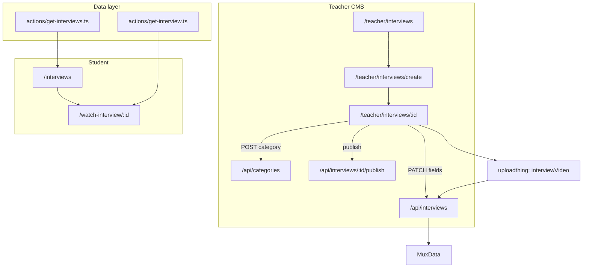

# Teacher & Student Interviews Feature

## Product decisions (locked in)

| Area | Decision |
|------|----------|
| Scope | Full stack (teacher CMS + student catalog + watch) |
| Data model | New `Interview` model; extend `MuxData` with `interviewId` |
| Access | Free for any logged-in user (no purchase) |
| URLs | `/interviews`, `/watch-interview/[id]`; PT rewrites `/entrevistas`, `/assistir-entrevista/:id` |
| Content | Title, rich description, thumbnail, Mux video + `guestName`, `guestCompany`, `guestRole`, difficulty, categories |
| Categories | `Category.kind` enum (`COURSE` \| `INTERVIEW`); unique name **per kind**; teacher creates INTERVIEW categories from setup (checkbox list + add form) |
| Publish gate | All fields required + at least one INTERVIEW category + `muxData` |
| Difficulty | `JUNIOR`, `MID`, `SENIOR`, `STAFF` |
| Catalog v1 | Title search only (`?title=`); guest + difficulty on cards; `createdAt desc` |
| Watch page | Player + guest block + difficulty badge + category chips + description; sidebar lists all published interviews |
| Teacher preview | Mux player on setup only — **no** `isTeacher` bypass on student watch route |
| Teacher table | Columns: title, guest, company, difficulty, published, actions |
| Nav | Unlock student sidebar “Entrevistas” (`MessagesSquare`) → `/interviews`; add teacher sidebar entry |
| Implementation | Copy/adapt seminar files (accept duplication for v1) |
| Tests/seed | Mirror seminar e2e + sample interviews in dev seed |
| Out of scope v1 | Metadata filters on catalog, analytics, shared abstractions refactor |

## Architecture



## 1. Schema changes

Edit [`prisma/schema.prisma`](prisma/schema.prisma):

**New enums**
- `CategoryKind`: `COURSE`, `INTERVIEW`
- `InterviewDifficulty`: `JUNIOR`, `MID`, `SENIOR`, `STAFF`

**`Category` changes**
- Add `kind CategoryKind @default(COURSE)`
- Add `interviewIDs String[] @db.ObjectId` + `interviews Interview[]` relation (mirror course pattern)
- Replace `name @unique` with `@@unique([name, kind])` (supports unique-within-kind)

**New `Interview` model** (mirror [`Seminar`](prisma/schema.prisma) + metadata):

```prisma
model Interview {
  id            String               @id @default(auto()) @map("_id") @db.ObjectId
  userId        String
  title         String
  description   String?              @db.String
  imageUrl      String?
  videoUrl      String?              @db.String
  guestName     String
  guestCompany  String
  guestRole     String
  difficulty    InterviewDifficulty
  isPublished   Boolean              @default(false)
  categoryIDs   String[]             @db.ObjectId
  categories    Category[]           @relation(fields: [categoryIDs], references: [id])
  muxData       MuxData?
  createdAt     DateTime             @default(now())
  updatedAt     DateTime             @updatedAt
  @@map("interviews")
}
```

**`MuxData` changes**
- Add optional `interviewId String? @unique` + `interview Interview?` relation (mutually exclusive with `chapterId` / `seminarId`; enforce in API like seminars)

**Migration note:** Existing categories get `kind: COURSE` via default. Run `prisma db push` + `prisma generate`.

## 2. API routes (copy from [`app/api/seminars/`](app/api/seminars/))

| Route | Behavior |
|-------|----------|
| `POST /api/interviews` | Teacher creates interview with `{ title }` |
| `PATCH /api/interviews/[id]` | Update fields; on `videoUrl` change → recreate Mux asset + `MuxData` (copy seminar PATCH logic) |
| `DELETE /api/interviews/[id]` | Delete Mux asset, `MuxData`, interview |
| `PATCH .../publish` | Require title, description, imageUrl, videoUrl, muxData, guestName, guestCompany, guestRole, difficulty, `categoryIDs.length >= 1` |
| `PATCH .../unpublish` | Set `isPublished: false` |
| `POST /api/categories` | Teacher-only; create `{ name, kind: "INTERVIEW" }`; validate unique within kind |

All mutations: `auth()` + `isTeacher()` + ownership (`interview.userId === userId`).

## 3. Server actions (copy from seminars)

| File | Role |
|------|------|
| [`actions/get-interviews.ts`](actions/get-interviews.ts) | Published interviews; optional `title` contains filter; include categories for card chips; `orderBy: createdAt desc` |
| [`actions/get-interview.ts`](actions/get-interview.ts) | Single interview + muxData; access: `isPublished && userId` only (**no teacher bypass**) |

## 4. Teacher UI (copy from [`app/(root)/(routes)/teacher/seminars/`](app/(root)/(routes)/teacher/seminars/))

| Route | Notes |
|-------|-------|
| `/teacher/interviews` | Data table with columns: title, guestName, guestCompany, difficulty, isPublished, actions |
| `/teacher/interviews/create` | Title-only form → `POST /api/interviews` → redirect to setup |
| `/teacher/interviews/[interviewId]` | Setup page with completion tracker |

**Setup forms** (inline edit pattern, PATCH per form):
- `InterviewTitleForm`
- `InterviewDescriptionForm` (reuse editor from seminar)
- `InterviewImageForm` (reuse `courseImage` UploadThing endpoint)
- `InterviewGuestForm` — guestName, guestCompany, guestRole (single form, 3 fields)
- `InterviewDifficultyForm` — select JUNIOR/MID/SENIOR/STAFF
- `InterviewCategoriesForm` — checkbox list of `kind: INTERVIEW` categories + “Add category” sub-form calling `POST /api/categories`
- `InterviewVideoForm` — new UploadThing endpoint `interviewVideo`; preview via MuxPlayer on setup

**Header:** `InterviewSetupHeader` + `InterviewActions` (publish/unpublish/delete) — publish disabled until all required fields complete (client) + server re-validation.

Add teacher sidebar entry in [`app/(root)/_components/sidebar-routes.tsx`](app/(root)/_components/sidebar-routes.tsx) after seminars.

## 5. Student UI (copy from seminars)

| Route | Notes |
|-------|-------|
| `/interviews` | Auth required (redirect `/`); `getInterviews({ title })`; `InterviewsList` + `InterviewCard` showing guest name + difficulty badge |
| `/watch-interview/[interviewId]` | Layout with sidebar listing all published interviews (copy [`watch-seminar/layout.tsx`](app/(course)/watch-seminar/layout.tsx)); page shows guest block, difficulty badge, category chips, description |

**Components to create** (adapt from seminar counterparts):
- `components/interviews-list.tsx`, `components/interview-card.tsx`
- `app/(course)/watch-interview/` — layout, navbar, sidebar, sidebar-item, video-player, `[interviewId]/page.tsx`

**Nav updates:**
- Uncomment/add student sidebar link in [`sidebar-routes.tsx`](app/(root)/_components/sidebar-routes.tsx)
- Extend [`components/navbar-routes.tsx`](components/navbar-routes.tsx) for `/interviews` search + back-to-interviews on watch routes (mirror seminar logic)

## 6. Uploads, i18n, config

- Add `interviewVideo` to [`app/api/uploadthing/core.ts`](app/api/uploadthing/core.ts) (copy `seminarVideo`)
- Language keys in [`languages/*.tsx`](languages/) + [`languages/language.d.ts`](languages/language.d.ts):
  - `sidebar.interviews`, `teacherInterviews`, `teacherInterviewCreate`, `teacherInterviewSetup`, `interviews` (student catalog), difficulty labels, guest field labels, category labels
- PT rewrites in [`next.config.mjs`](next.config.mjs):
  - `interviews` → `entrevistas`
  - `watch-interview` → `assistir-entrevista`
- Update [`/.cursor/skills/lms-domain/SKILL.md`](.cursor/skills/lms-domain/SKILL.md) with Interview domain section

## 7. Seed & E2E

**E2E fixtures** (extend [`e2e/constants.ts`](e2e/constants.ts), [`scripts/e2e-seed.ts`](scripts/e2e-seed.ts)):
- `E2E_PUBLISHED_INTERVIEW`, `E2E_DRAFT_INTERVIEW`, INTERVIEW-kind categories, mux fixture
- `watchInterviewPath()`, `teacherInterviewSetupPath()`

**E2E spec** [`e2e/student/interviews.spec.ts`](e2e/student/interviews.spec.ts) — mirror [`e2e/student/seminars.spec.ts`](e2e/student/seminars.spec.ts):
- Published on catalog, draft hidden, title search, watch page shows title + guest

**Dev seed** [`scripts/seed.ts`](scripts/seed.ts): 2–3 sample interviews with realistic guest metadata + INTERVIEW categories.

**Guest e2e:** Add `/interviews` redirect test in [`e2e/guest/catalog.spec.ts`](e2e/guest/catalog.spec.ts).

## 8. Publish completion checklist (teacher setup)

Server + client must agree on **9 required items**:

1. title
2. description
3. imageUrl
4. videoUrl + muxData
5. guestName
6. guestCompany
7. guestRole
8. difficulty
9. at least one INTERVIEW category

## 9. Risks and follow-ups

| Risk | Mitigation |
|------|------------|
| `Category.name` uniqueness migration | Use `@@unique([name, kind])`; seed/migrate existing rows as `COURSE` |
| Duplication vs seminars | Accepted for v1; note refactor ticket for shared video-content helpers |
| Category API is new | Keep minimal POST-only for v1; no delete/rename UI unless needed |
| Teacher can't preview drafts on watch URL | Intentional; document in setup copy if confusing |

**Fast follow (not v1):** catalog filters by `?difficulty=` and `?categoryId=`; metadata search; analytics; extract shared seminar/interview primitives.

## Verification

- `npx prisma generate && npx prisma db push`
- `npm run build` / `npm run lint`
- Manual: teacher create → fill all fields → publish → student sees on `/interviews` → watch plays
- `npx playwright test e2e/student/interviews.spec.ts e2e/guest/catalog.spec.ts`
