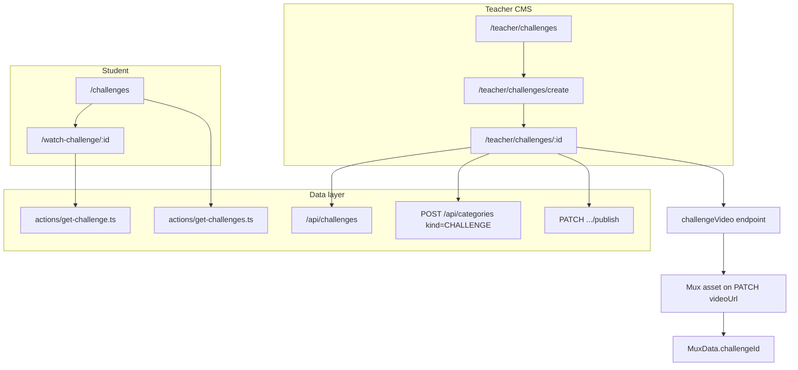

# Challenges Feature Plan

## Locked product decisions (from discovery)

| Area | Decision |
|------|----------|
| Content unit | Single recorded video per challenge (Seminar clone) |
| Student interaction | Watch/read only — no progress, submissions, or attachments |
| Access | Free for any logged-in user; guests redirected from catalog/watch |
| Teacher preview | **No** `isTeacher()` bypass on watch page (Interview/Mentorship style); Mux preview on setup only |
| Publish gate | **Seminar parity:** `title`, `description`, `imageUrl`, `videoUrl`, `muxData` (5/5) |
| Difficulty | New `ChallengeDifficulty` enum: `EASY`, `MEDIUM`, `HARD` — **optional** (`null` allowed); not required to publish |
| Categories | New `CategoryKind.CHALLENGE`; `categoryIDs[]` on model — **optional** at publish (can be empty) |
| Student watch UI | Title + Mux player + **difficulty badge (if set)** + **category chips (if any)** + description |
| Catalog v1 | Title search only (`?title=`) — no category/difficulty filters yet |
| URLs | `/challenges`, `/watch-challenge/[challengeId]`, `/teacher/challenges` |
| PT rewrites | `challenges` → `desafios`, `watch-challenge` → `assistir-desafio` in [`next.config.mjs`](next.config.mjs) |
| Sidebar | Uncomment existing stub position in [`sidebar-routes.tsx`](app/(root)/_components/sidebar-routes.tsx) — `Puzzle` icon, after Interviews; add matching teacher tab before Analytics |
| Sidebar label | Localized `"Challenges"` per language file (not hard-coded Portuguese) |
| Tests/seed | Full E2E mirror (guest + student + teacher), same pattern as seminars/interviews |
| Implementation | Copy/adapt existing seminar + interview/mentorship files (accept v1 duplication) |

**Out of scope v1:** purchase model, completion tracking, solution submission, catalog filters, analytics, attachments, course/career links, comments.

---

## Architecture



**Access rule** (`get-challenge.ts`): `canAccess = challenge.isPublished && !!userId` (no teacher bypass). Unpublished drafts redirect to `/challenges`.

---

## 1. Prisma schema

**File:** [`prisma/schema.prisma`](prisma/schema.prisma)

Add enum:

```prisma
enum ChallengeDifficulty {
  EASY
  MEDIUM
  HARD
}
```

Extend `CategoryKind`:

```prisma
enum CategoryKind {
  COURSE
  INTERVIEW
  MENTORSHIP
  CHALLENGE
}
```

Add `Challenge` model (Seminar + interview-style metadata):

```prisma
model Challenge {
  id           String               @id @default(auto()) @map("_id") @db.ObjectId
  userId       String
  title        String
  description  String?              @db.String
  imageUrl     String?
  videoUrl     String?              @db.String
  difficulty   ChallengeDifficulty?
  isPublished  Boolean              @default(false)
  categoryIDs  String[]             @db.ObjectId
  categories   Category[]           @relation(fields: [categoryIDs], references: [id])
  muxData      MuxData?
  createdAt    DateTime             @default(now())
  updatedAt    DateTime             @updatedAt

  @@map("challenges")
}
```

Extend `Category`:

```prisma
challengeIDs String[]   @db.ObjectId
challenges   Challenge[] @relation(fields: [challengeIDs], references: [id])
```

Extend `MuxData`:

```prisma
challengeId String?   @unique @db.ObjectId
challenge   Challenge? @relation(fields: [challengeId], references: [id], onDelete: Cascade)
```

Run: `npx prisma generate` + `npx prisma db push`.

---

## 2. API routes

Mirror [`app/api/seminars/`](app/api/seminars/) and [`app/api/interviews/`](app/api/interviews/) patterns.

| Route | Source to copy | Notes |
|-------|----------------|-------|
| `POST /api/challenges` | [`app/api/seminars/route.ts`](app/api/seminars/route.ts) | `{ userId, title }` only |
| `PATCH/DELETE /api/challenges/[challengeId]` | [`app/api/seminars/[seminarId]/route.ts`](app/api/seminars/[seminarId]/route.ts) | Mux lifecycle on `videoUrl`; allow PATCH `difficulty`, `categoryIDs`, `description`, `imageUrl`, `title` |
| `PATCH .../publish` | [`app/api/seminars/[seminarId]/publish/route.ts`](app/api/seminars/[seminarId]/publish/route.ts) | 5-field gate only — **do not** require categories or difficulty |
| `PATCH .../unpublish` | seminar unpublish | Sets `isPublished: false` |

**Categories:** extend [`app/api/categories/route.ts`](app/api/categories/route.ts) to accept `CategoryKind.CHALLENGE` in POST validation (today allows `INTERVIEW` and `MENTORSHIP` only).

Category assignment on challenge: follow interview PATCH pattern (update `categoryIDs` + sync `Category.challengeIDs` if the interview API does bidirectional sync — verify in [`app/api/interviews/[interviewId]/route.ts`](app/api/interviews/[interviewId]/route.ts) and mirror).

---

## 3. Server actions

| File | Pattern | Behavior |
|------|---------|----------|
| [`actions/get-challenges.ts`](actions/get-challenges.ts) | [`actions/get-seminars.ts`](actions/get-seminars.ts) | `isPublished: true`, optional `title` contains filter, `include: { categories: true }` for catalog cards |
| [`actions/get-challenge.ts`](actions/get-challenge.ts) | [`actions/get-interview.ts`](actions/get-interview.ts) | Published + logged-in only; include `muxData` + `categories` |

---

## 4. Teacher UI

Copy [`app/(root)/(routes)/teacher/seminars/`](app/(root)/(routes)/teacher/seminars/) tree → `teacher/challenges/`:

| Route / component | Adapt from |
|-------------------|------------|
| List + data-table + columns | seminars (title, published badge, edit action) |
| Create page | seminars create (title → POST → redirect) |
| Setup page | seminars `[seminarId]/page.tsx` — **5-field** `requiredFields` for publish button |
| Title / description / image / video forms | seminar `*-form.tsx` files (rename + language keys) |
| Difficulty form | [`interview-difficulty-form.tsx`](app/(root)/(routes)/teacher/interviews/[interviewId]/_components/interview-difficulty-form.tsx) — use `ChallengeDifficulty` + new i18n labels (Easy/Medium/Hard) |
| Categories form | [`interview-categories-form.tsx`](app/(root)/(routes)/teacher/interviews/[interviewId]/_components/interview-categories-form.tsx) — `CategoryKind.CHALLENGE` |

Setup layout: left column = title, description, image, difficulty, categories; right column = video (same grid as seminars/interviews).

---

## 5. Student UI

| Piece | Adapt from |
|-------|------------|
| [`app/(root)/(routes)/challenges/page.tsx`](app/(root)/(routes)/challenges/page.tsx) | [`seminars/page.tsx`](app/(root)/(routes)/seminars/page.tsx) |
| [`components/challenges-list.tsx`](components/challenges-list.tsx) + [`components/challenge-card.tsx`](components/challenge-card.tsx) | seminars-list + seminar-card; optionally show difficulty badge on card when set |
| Watch layout shell | [`watch-seminar/layout.tsx`](app/(course)/watch-seminar/layout.tsx) → `watch-challenge/` (navbar, sidebar, mobile sidebar) |
| Watch page | [`watch-interview/[interviewId]/page.tsx`](app/(course)/watch-interview/[interviewId]/page.tsx) — metadata badges without guest fields |
| Video player | copy seminar/interview player component |

Redirect failures to `/challenges` (not `/`).

---

## 6. Config, nav, i18n

- **UploadThing:** add `challengeVideo` endpoint in [`app/api/uploadthing/core.ts`](app/api/uploadthing/core.ts) (same limits as `seminarVideo`).
- **Sidebar:** uncomment/add routes in [`sidebar-routes.tsx`](app/(root)/_components/sidebar-routes.tsx); teacher tab before Analytics.
- **Navbar:** extend [`components/navbar-routes.tsx`](components/navbar-routes.tsx) — desktop search on `/challenges`, `goBackToChallenges` on watch routes (mirror seminars/interviews).
- **SearchInput:** add `/challenges` placeholder branch in [`components/search-input.tsx`](components/search-input.tsx).
- **next.config.mjs:** PT rewrites + add `watch-challenge` to `watchRoutePrefixes` (or equivalent array used for middleware/layout routing).
- **Languages:** add keys to [`languages/english.tsx`](languages/english.tsx), [`portuguese.tsx`](languages/portuguese.tsx), [`spanish.tsx`](languages/spanish.tsx), [`french.tsx`](languages/french.tsx), and [`languages/language.d.ts`](languages/language.d.ts) — mirror seminar + interview key groups (`challenges`, `teacherChallenges`, `teacherChallengeCreate`, `teacherChallengeSetup`, `watchChallengeURL`, difficulty labels).
- **Domain docs:** update [`.cursor/skills/lms-domain/SKILL.md`](.cursor/skills/lms-domain/SKILL.md).

---

## 7. E2E fixtures and tests

Mirror [`e2e/student/interviews.spec.ts`](e2e/student/interviews.spec.ts) + [`e2e/teacher/seminars.spec.ts`](e2e/teacher/seminars.spec.ts):

- Add `E2E_PUBLISHED_CHALLENGE`, `E2E_DRAFT_CHALLENGE`, mux fixture constants in [`e2e/constants.ts`](e2e/constants.ts)
- Seed in [`scripts/e2e-seed.ts`](scripts/e2e-seed.ts) — published with fake `MuxData`, draft unpublished
- New specs: `e2e/guest/catalog.spec.ts` (guest redirect), `e2e/student/challenges.spec.ts`, `e2e/teacher/challenges.spec.ts`
- Update [`e2e/README.md`](e2e/README.md)

---

## 8. Verification checklist

| Check | Expected |
|-------|----------|
| Teacher CRUD | Create → setup all 5 core fields → publish → appears on `/challenges` |
| Optional metadata | Can publish with empty categories and null difficulty; badges appear when later set |
| Draft hidden | Unpublished challenge absent from student catalog |
| Watch access | Logged-in student plays published challenge; guest redirected |
| Teacher draft watch | Unpublished challenge redirects student watch URL to `/challenges` (no teacher bypass) |
| Mux replace | Re-uploading video replaces Mux asset (same as seminar) |
| PT URLs | `/desafios` and `/assistir-desafio/:id` resolve when locale is PT |
| Regression | Seminars, interviews, mentorships, courses unchanged |

---

## Key files to leverage (copy sources)

- Seminar stack: [`teacher/seminars/`](app/(root)/(routes)/teacher/seminars/), [`app/api/seminars/`](app/api/seminars/), [`actions/get-seminars.ts`](actions/get-seminars.ts), [`watch-seminar/`](app/(course)/watch-seminar/)
- Interview metadata: difficulty + categories forms, watch-page badges, [`get-interview.ts`](actions/get-interview.ts) access model
- Mentorship plan reference: [`.cursor/plans/mentorship_feature_plan_b87f4c26.plan.md`](.cursor/plans/mentorship_feature_plan_b87f4c26.plan.md) for end-to-end file checklist

---

## Assumptions (flagged, not blocking)

- **ASSUMPTION (M):** Difficulty badge on catalog cards is nice-to-have in v1; watch page badges are required per your answer. Implement card badges if low effort when building `challenge-card.tsx`.
- **ASSUMPTION (L):** PT slug `desafios` / `assistir-desafio` — confirm or adjust before merge if marketing prefers different URLs.
- **ASSUMPTION (H):** `ChallengeDifficulty` is nullable; clearing difficulty in teacher UI sets `null` (publish still allowed).
