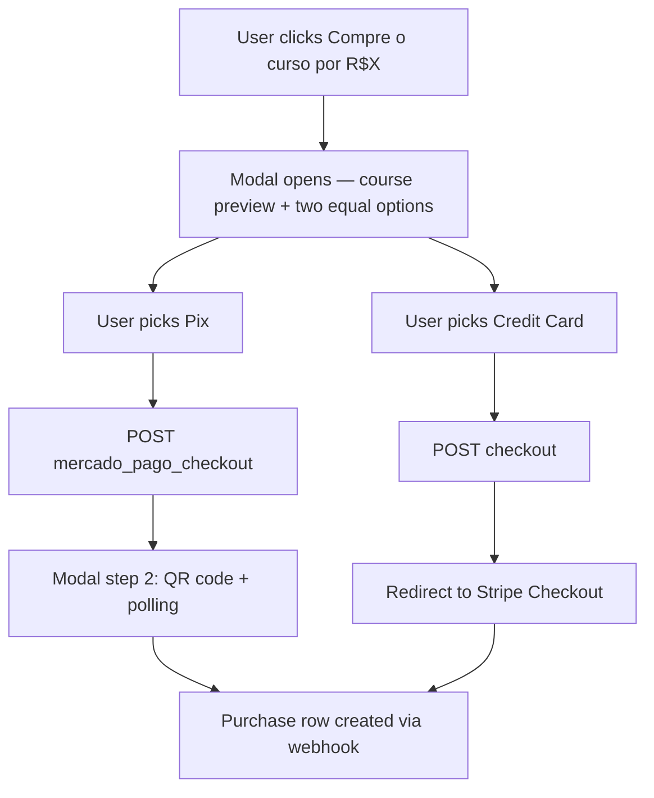

# Dual Payment Method Checkout (Pix + Credit Card)

## What exists today

Payment method is chosen at **build time**, not by the user:

```65:68:app/(course)/watch-course/[courseId]/chapters/[chapterId]/page.tsx
    const SelectedCheckoutButton =
        process.env.NEXT_PUBLIC_LANGUAGE == "portuguese"
            ? MergadoPagoCheckoutButtonWithProps
            : StripeCheckoutButtonWithProps;
```

- **Portuguese** → [`course-enroll-button-mercado-pago.tsx`](app/(course)/watch-course/[courseId]/chapters/[chapterId]/_components/course-enroll-button-mercado-pago.tsx): opens a Dialog, but **calls the Pix API on the trigger click** (before the user explicitly chose Pix).
- **Other locales** → [`course-enroll-button-stripe.tsx`](app/(course)/watch-course/[courseId]/chapters/[chapterId]/_components/course-enroll-button-stripe.tsx): redirects to Stripe Checkout.

Both backends already work and both create a `Purchase` row:

| Method | API | Post-payment |
|--------|-----|--------------|
| Pix | `POST /api/courses/[courseId]/mercado_pago_checkout` | In-modal QR + polling `GET /api/purchase/[courseId]` |
| Card | `POST /api/courses/[courseId]/checkout` | Redirect to Stripe → webhook `POST /api/webhook` |

## Decisions (confirmed)

| Decision | Choice |
|----------|--------|
| Who sees both options | Portuguese deployment only (`NEXT_PUBLIC_LANGUAGE=portuguese`) |
| UX | Modal: step 1 pick method → Pix shows QR in same modal; Card redirects to Stripe |
| Visual emphasis | Equal — no "recommended" badge |
| Course preview | Show on both steps (method picker + Pix QR) |
| Back navigation from Pix | No — close modal to restart |
| Webhook fix | Yes — fix MP metadata mismatch in same PR |

## Target flow



## Implementation

### 1. New unified checkout modal component

Create [`course-checkout-modal.tsx`](app/(course)/watch-course/[courseId]/chapters/[chapterId]/_components/course-checkout-modal.tsx) (`"use client"`).

**Props:** `courseId`, `price`, `course` (same preview shape as today: `title`, `description`, `imageUrl`, `price`).

**State:**
- `step: 'method' | 'pix'`
- `loading`, `payment`, `status` (reuse Pix polling logic from mercado-pago component)
- `intervalRef` for 5s polling via `GET /api/purchase/[courseId]`

**Step `method`:**
- Reuse course preview layout from existing Pix dialog (image, title, price).
- Two equal-styled buttons: **Pix** and **Cartão de crédito**.
- Do **not** call any payment API until the user picks a method.

**On Pix click:** set loading → `POST /api/courses/${courseId}/mercado_pago_checkout` → set `step: 'pix'`, start polling.

**On Card click:** set loading → `POST /api/courses/${courseId}/checkout` → `window.location.assign(url)` (same as Stripe button today). Show toast on error via `language.somethingWentWrong`.

**Step `pix`:**
- Keep course preview visible at top.
- Reuse QR display, copy-to-clipboard, manual "check payment" button, and status messages from [`course-enroll-button-mercado-pago.tsx`](app/(course)/watch-course/[courseId]/chapters/[chapterId]/_components/course-enroll-button-mercado-pago.tsx).
- On `status === 'approved'`: `router.refresh()` (existing behavior).

**Trigger button:** Same styling as today — `${language.enrollFor} ${formatPrice(price)}`.

Use existing [`Dialog`](components/ui/dialog) primitives (same as current Pix component).

### 2. Wire into chapter page

Update [`page.tsx`](app/(course)/watch-course/[courseId]/chapters/[chapterId]/page.tsx):

- **Portuguese:** render `CourseCheckoutModal` (pass `courseFull` for preview).
- **Other locales:** keep `StripeCheckoutButton` unchanged.
- Remove `MercadoPagoCheckoutButton` import and the inline wrapper components.

### 3. Retire the standalone Mercado Pago button

After logic is migrated into `CourseCheckoutModal`, **delete** [`course-enroll-button-mercado-pago.tsx`](app/(course)/watch-course/[courseId]/chapters/[chapterId]/_components/course-enroll-button-mercado-pago.tsx) to avoid dead code. Keep [`course-enroll-button-stripe.tsx`](app/(course)/watch-course/[courseId]/chapters/[chapterId]/_components/course-enroll-button-stripe.tsx) for non-Portuguese locales.

### 4. Fix Mercado Pago webhook metadata (bug)

Checkout sends camelCase:

```49:52:app/api/courses/[courseId]/mercado_pago_checkout/route.ts
                metadata: {
                    userId: user.id,
                    courseId: course.id,
                },
```

Webhook reads snake_case (`user_id`, `course_id`) — purchases may never be created from webhooks. Polling works only if something else created the purchase.

**Fix in** [`app/api/webhook/mercado_pago/route.ts`](app/api/webhook/mercado_pago/route.ts):

```typescript
const userId = mpPayment.metadata?.userId ?? mpPayment.metadata?.user_id;
const courseId = mpPayment.metadata?.courseId ?? mpPayment.metadata?.course_id;
```

Accept both forms for backward compatibility.

### 5. Internationalization

Move hardcoded Portuguese strings from the old MP component into language files.

Add a `courseCheckout` section to [`languages/language.d.ts`](languages/language.d.ts) and all four language files ([`portuguese.tsx`](languages/portuguese.tsx), [`english.tsx`](languages/english.tsx), [`spanish.tsx`](languages/spanish.tsx), [`french.tsx`](languages/french.tsx)):

- `unlockFullAccess` — modal title
- `payWithPix` / `payWithCard` — method buttons
- `generatingPix` — loading state
- `scanQrCode` / `orCopyCode` / `copy` / `checkPaymentNow` / `awaitingConfirmation`
- `paymentApproved` / `paymentRejected`
- `pixCopied` / `copyFailed` — clipboard feedback (replace `alert()` with `toast` to match Stripe button)

Only Portuguese deployment uses these strings in practice, but all language files must satisfy the shared type.

### 6. Optional polish (low scope, include if quick)

- Add `data-testid="course-checkout-trigger"`, `data-testid="checkout-pix"`, `data-testid="checkout-card"` for future e2e (mentioned in [`e2e/README.md`](e2e/README.md)).
- Replace `alert()` for clipboard with `react-hot-toast` (already used in Stripe button).

## Files touched

| File | Action |
|------|--------|
| `_components/course-checkout-modal.tsx` | **Create** |
| `_components/course-enroll-button-mercado-pago.tsx` | **Delete** |
| `chapters/[chapterId]/page.tsx` | **Update** wiring |
| `app/api/webhook/mercado_pago/route.ts` | **Fix** metadata keys |
| `languages/language.d.ts` + 4 language files | **Add** `courseCheckout` keys |

No API route changes needed — both checkout endpoints already exist.

## Verification

**Manual (Portuguese env):**
1. Open a locked chapter as a student without purchase.
2. Click enroll → modal opens with course preview and two equal options. **No network call yet.**
3. Pick **Pix** → QR appears in same modal; polling detects purchase after webhook/simulated payment.
4. Pick **Card** → redirects to Stripe Checkout sandbox.
5. Close modal during Pix step → reopening starts fresh at method picker.

**Manual (non-Portuguese env):**
6. Confirm single Stripe button still works (no modal).

**Webhook:**
7. Send a test MP webhook payload with `metadata.userId` / `metadata.courseId` → `Purchase` row created.

**Checks to run:**
- `npm run lint` / `npm run build` (or project equivalents)
- No new e2e tests required unless you want them (payment flows are explicitly out of scope in e2e README)

## Risks

- **Stripe redirect closes modal** — expected; user returns via `success_url` on watch-course page.
- **Pix with no back button** — if user picks Pix, a payment is created server-side; closing and reopening may create a second pending Pix payment. Acceptable per your choice; document if it becomes a support issue.
- **MP metadata** — fixing webhook may suddenly start creating purchases that polling alone previously missed; low risk, correct behavior.

## Out of scope

- Other purchase entry points (landing/career pages don't have enroll buttons today).
- Subscription checkout (Stripe-only, separate flow).
- Runtime locale switching (build-time `NEXT_PUBLIC_LANGUAGE` only).
- Mercado Pago credit card (only Pix via MP; card goes through Stripe).
