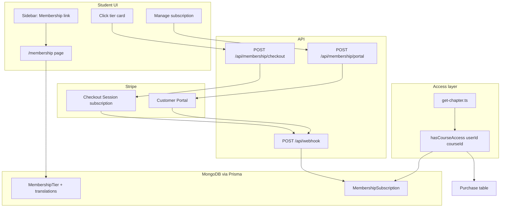

# Paid Membership (Silver / Gold / Diamond)

## Confirmed product decisions

| Area | Decision |
|------|----------|
| Billing | Monthly recurring via Stripe (`mode: "subscription"`) |
| Course access | Any **active** tier unlocks **all** paid courses; tiers differ in price/perks copy only (for now) |
| Individual purchases | Kept — membership is additive, not a replacement |
| Payments | Stripe card Checkout + Stripe Customer Portal (manage/cancel) |
| Sidebar | Main student sidebar in [`app/(root)/_components/sidebar-routes.tsx`](app/(root)/_components/sidebar-routes.tsx) |
| Checkout UX | Click tier card → `POST /api/membership/checkout` → redirect to Stripe (no intermediate page) |
| Member page | 3 tier cards; current tier highlighted + renewal date + Portal link |
| Upgrades | Upgrade-only; higher-tier card click **and** Portal |
| Tier content | Teacher admin UI; DB-backed, editable per locale |
| Prices | Placeholder until teacher configures (sync to Stripe on save) |
| i18n | All 4 locales (PT, EN, FR, ES) |
| Auth | Membership page requires login |
| Webhooks | `checkout.session.completed`, `customer.subscription.updated`, `customer.subscription.deleted`, `invoice.payment_failed` |
| Payment failed | **Immediate** access revoke |
| Voluntary cancel | Access until `currentPeriodEnd` (Stripe default) |

## Current codebase gaps

- **No membership models** in [`prisma/schema.prisma`](prisma/schema.prisma) — only `Purchase` (one-time course) and `StripeCustomer`.
- **Course checkout is one-time** — [`app/api/courses/[courseId]/checkout/route.ts`](app/api/courses/[courseId]/checkout/route.ts) uses `mode: "payment"`.
- **Webhook is course-only** — [`app/api/webhook/route.ts`](app/api/webhook/route.ts) handles `checkout.session.completed` with `courseId` metadata only.
- **Access checks are purchase-only** — [`actions/get-chapter.ts`](actions/get-chapter.ts) gates video on `purchase || chapter.isFree || isTeacher`.
- **Landing subscription page is a stub** — [`app/landing_page/(routes)/subscription/page.tsx`](app/landing_page/(routes)/subscription/page.tsx) calls `/api/subscription/*` routes that **do not exist** (out of scope unless you want to wire them later).
- **Sales funnel tiers are lifetime copy** ([`languages/portuguese/sales-funnel.json`](languages/portuguese/sales-funnel.json)) — not the source of truth for monthly membership; reuse [`TierCard`](app/landing_page/(routes)/sales-funnel/_components/tier-card.tsx) **layout patterns** only.

## Architecture



## 1. Data model (Prisma)

Add enums and models to [`prisma/schema.prisma`](prisma/schema.prisma):

```prisma
enum MembershipTierSlug {
  SILVER
  GOLD
  DIAMOND
}

enum MembershipSubscriptionStatus {
  ACTIVE
  PAST_DUE
  CANCELED
  INCOMPLETE
}

model MembershipTier {
  id              String            @id @default(auto()) @map("_id") @db.ObjectId
  slug            MembershipTierSlug @unique
  position        Int               // 1=silver, 2=gold, 3=diamond
  monthlyPriceBrl Float             // display + Stripe sync source
  stripeProductId String?
  stripePriceId   String?           // recurring price ID
  isActive        Boolean           @default(true)
  translations    MembershipTierTranslation[]
  createdAt       DateTime          @default(now())
  updatedAt       DateTime          @updatedAt
  @@map("membership_tiers")
}

model MembershipTierTranslation {
  id                      String         @id @default(auto()) @map("_id") @db.ObjectId
  tierId                  String         @db.ObjectId
  tier                    MembershipTier @relation(...)
  locale                  String         // "portuguese" | "english" | "french" | "spanish"
  name                    String
  tagline                 String?
  features                String[]       // bullet list
  newFeaturesHeading      String?
  newFeatures             String[]
  exclusiveAccessHeading  String?
  exclusiveAccess         String[]
  @@unique([tierId, locale])
  @@map("membership_tier_translations")
}

model MembershipSubscription {
  id                   String                       @id @default(auto()) @map("_id") @db.ObjectId
  userId               String                       @unique  // one active sub per user in v1
  tierId               String                       @db.ObjectId
  tier                 MembershipTier               @relation(...)
  stripeSubscriptionId String                       @unique
  stripeCustomerId     String
  status               MembershipSubscriptionStatus
  currentPeriodEnd     DateTime?
  cancelAtPeriodEnd    Boolean                      @default(false)
  createdAt            DateTime                     @default(now())
  updatedAt            DateTime                     @updatedAt
  @@map("membership_subscriptions")
}
```

**Seed script** (`prisma/seed-membership.ts` or extend existing seed): 3 tiers with placeholder monthly prices (e.g. R$99 / R$149 / R$199 — adjust in teacher UI later) and empty Stripe IDs until first admin save syncs them.

## 2. Shared access helper

Create [`lib/membership.ts`](lib/membership.ts):

- `getActiveMembership(userId)` — returns subscription when `status === ACTIVE` and `currentPeriodEnd > now` (if set).
- `hasCourseAccess({ userId, courseId })` — `true` if `Purchase` exists **or** active membership **or** `isTeacher(userId)`.

Update all purchase gates to use this helper:

| File | Change |
|------|--------|
| [`actions/get-chapter.ts`](actions/get-chapter.ts) | Treat active membership like `purchase` for mux/attachments/nextChapter |
| [`actions/get-dashboard-courses.ts`](actions/get-dashboard-courses.ts) | If member: return **all published courses** with progress; else existing purchased-only logic |
| [`actions/get-courses.ts`](actions/get-courses.ts) | Mark courses as accessible/enrolled when membership active (for catalog progress UI) |
| [`app/(course)/watch-course/.../page.tsx`](app/(course)/watch-course/[courseId]/chapters/[chapterId]/page.tsx) | Hide checkout modal when member |
| [`app/api/courses/[courseId]/checkout/route.ts`](app/api/courses/[courseId]/checkout/route.ts) | Reject checkout if user already has active membership (optional guard) |

Extract `getOrCreateStripeCustomer(userId, email)` from course checkout into [`lib/stripe-customer.ts`](lib/stripe-customer.ts) for reuse.

## 3. Student UI

### Sidebar entry

In [`sidebar-routes.tsx`](app/(root)/_components/sidebar-routes.tsx), add to `userRoutes`:

- Icon: `Crown` or `Gem` (lucide)
- Label + URL from i18n: `language.membership`, `language.membershipURL` (add to [`languages/language.d.ts`](languages/language.d.ts) + all 4 locale files)

### Membership page

New route: [`app/(root)/(routes)/membership/page.tsx`](app/(root)/(routes)/membership/page.tsx)

- Server component: `auth()` → redirect if unauthenticated.
- Fetch active tiers (ordered by `position`) with translation for `NEXT_PUBLIC_LANGUAGE`.
- Fetch user's `MembershipSubscription` if any.

**Non-member state:** 3 [`MembershipTierCard`](app/(root)/(routes)/membership/_components/membership-tier-card.tsx) client components — adapted from sales-funnel `TierCard` but:
- No sign-up link; entire card clickable → calls checkout API.
- No default highlight.

**Member state:**
- Current tier card: highlighted border (reuse sales-funnel `highlighted` styling).
- Subscription panel: tier name, status, `currentPeriodEnd`, `cancelAtPeriodEnd` flag.
- **Manage subscription** button → `POST /api/membership/portal` → redirect to Stripe Portal.
- Higher tiers: show upgrade CTA (click → checkout API with `tierSlug` + `mode: "upgrade"`).

### i18n keys (all 4 locales)

Add `membership` section: page title, manage button, renewal label, upgrade CTA, empty/loading/error strings, sidebar label/URL. Tier **content** comes from DB translations, not static JSON.

## 4. Checkout and upgrade API

### `POST /api/membership/checkout`

New file: [`app/api/membership/checkout/route.ts`](app/api/membership/checkout/route.ts)

Body: `{ tierSlug: "SILVER" | "GOLD" | "DIAMOND" }`

Logic:

1. Auth required.
2. Load tier + verify `isActive` and `stripePriceId`.
3. **New subscriber:** if no subscription row → create Checkout Session:
   - `mode: "subscription"`
   - `line_items: [{ price: tier.stripePriceId, quantity: 1 }]`
   - `metadata: { userId, tierSlug, type: "membership" }`
   - `success_url` / `cancel_url` → `/membership?success=1` / `?canceled=1`
4. **Upgrade (upgrade-only):** if existing `ACTIVE` sub on lower tier → `stripe.subscriptions.update(subId, { items: [{ id: itemId, price: newPriceId }], proration_behavior: "create_prorations" })` and update DB tier on success; return `{ upgraded: true }` instead of redirect. Block downgrades with 400.
5. Block duplicate same-tier subscribe.

### `POST /api/membership/portal`

New file: [`app/api/membership/portal/route.ts`](app/api/membership/portal/route.ts)

- Create Stripe Billing Portal session for user's `stripeCustomerId`.
- Configure Portal in Stripe Dashboard: allow cancel, payment method update; **disable downgrade** products if possible; upgrades can also happen here.

## 5. Webhook extensions

Extend [`app/api/webhook/route.ts`](app/api/webhook/route.ts) (or split into handler modules under `lib/stripe-webhooks/`):

| Event | Behavior |
|-------|----------|
| `checkout.session.completed` | If `metadata.type === "membership"`: upsert `MembershipSubscription` as `ACTIVE`, store `stripeSubscriptionId`, `tierId`, `currentPeriodEnd` |
| `customer.subscription.updated` | Sync `status`, `tierId` (from price → tier lookup), `currentPeriodEnd`, `cancelAtPeriodEnd` |
| `customer.subscription.deleted` | Set status `CANCELED`; access ends at period end (already past when event fires) |
| `invoice.payment_failed` | Set status `PAST_DUE` or `CANCELED`; **immediate revoke** — treat non-`ACTIVE` as no access in `hasCourseAccess` |

Keep existing course `checkout.session.completed` path unchanged (check `metadata.courseId` vs `metadata.type`).

**Stripe Dashboard:** Register new event types on the existing webhook endpoint.

## 6. Teacher admin UI

New teacher section (follow existing form patterns from [`app/(root)/(routes)/teacher/courses/[courseId]/_components/price-form.tsx`](app/(root)/(routes)/teacher/courses/[courseId]/_components/price-form.tsx)):

- Route: `/teacher/membership` (add to teacher sidebar in [`sidebar-routes.tsx`](app/(root)/_components/sidebar-routes.tsx) `teacherRoutes`)
- List 3 tiers; edit per tier:
  - Monthly price (BRL)
  - Per-locale translations (tabs or accordion for PT/EN/FR/ES): name, tagline, feature lists
- On save:
  - Create/update Stripe Product + recurring Price via Stripe API when price changes
  - Store `stripeProductId` / `stripePriceId` on tier
  - **Do not** migrate existing subscribers automatically when price changes (new price applies to new checkouts only)

API routes under `app/api/teacher/membership/` with `isTeacher()` guard (same pattern as course APIs).

## 7. Stripe configuration checklist

- Create Stripe Products for Silver/Gold/Diamond (or let admin UI create on first save).
- Enable **Customer Portal** in Stripe Dashboard.
- Webhook secret already exists (`STRIPE_WEBHOOK_SECRET`) — add subscription events.
- Placeholder prices until product owner sets final amounts in teacher UI.

## 8. Suggested implementation slices

**Slice A — Foundation:** Prisma models, seed, `lib/membership.ts`, webhook handlers, access helper wired into `get-chapter`.

**Slice B — Student UX:** Sidebar link, membership page, tier cards, checkout + portal APIs.

**Slice C — Teacher admin:** Tier CRUD + Stripe price sync.

**Slice D — Polish:** Dashboard/catalog membership awareness, hide course checkout for members, e2e test for member course access.

## 9. Verification plan

- Teacher: edit tier copy in all 4 locales; set price → Stripe Price created.
- Student (no membership): sees 3 cards; click Gold → Stripe Checkout → pay → webhook → membership active.
- Member: current tier highlighted; Portal opens; renewal date shown.
- Member: open locked course chapter → video plays without purchase.
- Member: upgrade Silver → Gold via higher-tier card → prorated upgrade; DB tier updated.
- Payment failure webhook → status not ACTIVE → course locked again.
- Cancel via Portal → access until period end → then locked after `subscription.deleted`.
- Existing course `Purchase` still works independently.

## 10. Risks and open items

- **Placeholder prices** — confirm final BRL amounts before production; until then seed values are arbitrary.
- **Single subscription per user** — v1 uses `userId @unique` on `MembershipSubscription`; upgrading updates same row.
- **Immediate revoke on payment failure** differs from voluntary cancel — document clearly in member UI if status becomes `PAST_DUE`.
- **Landing page stub** (`/landing_page/subscription`) still references missing APIs — separate cleanup ticket unless you want it redirected to `/membership`.
- **Mercado Pago** explicitly out of scope (Stripe only per your choice).

## Remaining questions (non-blocking)

These can be decided during implementation without changing architecture:

1. Exact placeholder monthly prices for seed data?
2. Should the membership sidebar item show a badge when user is not subscribed (e.g. "Upgrade")?
3. Should members still see "Compre o curso" on chapter pages, or a "Included in your membership" message instead?
