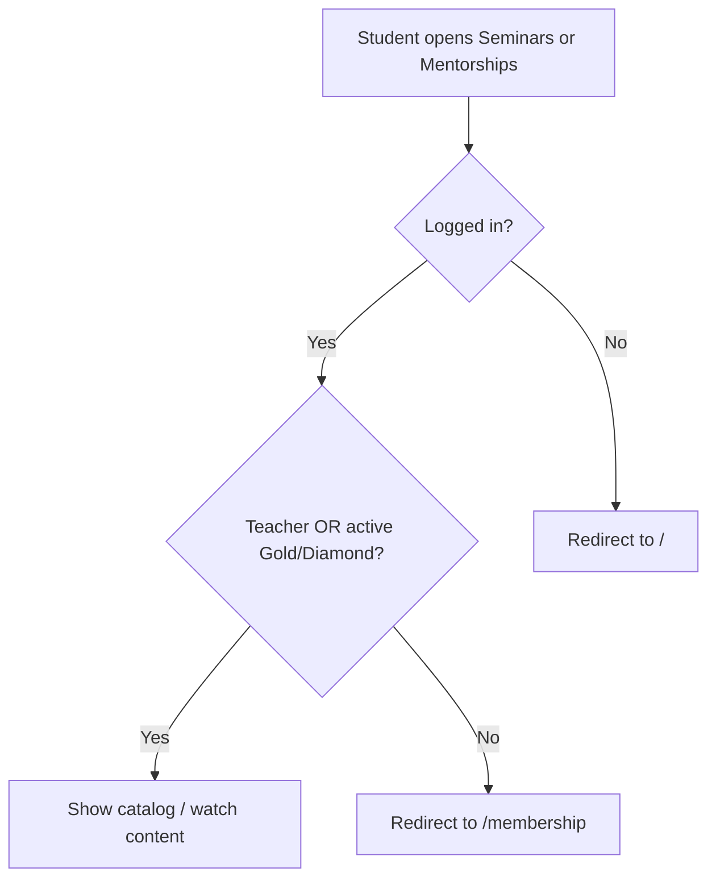

# Gold/Diamond Gating for Mentorship and Seminars

## Goal

Mentorship and Seminars are currently available to **any logged-in user** ([`get-seminar.ts`](actions/get-seminar.ts), [`get-mentorship.ts`](actions/get-mentorship.ts)). Course access already uses [`lib/membership.ts`](lib/membership.ts) with **any active tier**. This change adds a **separate, tier-specific gate**: only `GOLD` and `DIAMOND` (plus teachers).

Confirmed UX: **show locked tabs** in the sidebar; clicking a locked tab goes to the membership page.

## Access model



| User | Mentorship / Seminars |
|------|------------------------|
| Guest | Redirect `/` (unchanged) |
| Logged-in, no membership | Locked sidebar → `/membership`; direct URL → `/membership` |
| Silver member | Same as no membership |
| Gold / Diamond member | Full access |
| Teacher | Full access (student + teacher routes) |

## 1. Shared access helper

Extend [`lib/membership.ts`](lib/membership.ts):

```typescript
const PREMIUM_CONTENT_TIERS = new Set<MembershipTierSlug>(["GOLD", "DIAMOND"]);

export async function hasGoldOrDiamondAccess(userId: string): Promise<boolean> {
  if (isTeacher(userId)) return true;
  const membership = await getActiveMembership(userId);
  return membership !== null && PREMIUM_CONTENT_TIERS.has(membership.tier.slug);
}
```

Keep `hasCourseAccess` unchanged (any active tier still unlocks paid courses).

## 2. Server route guards (primary enforcement)

Add the same guard to all student-facing entry points:

| File | Change |
|------|--------|
| [`app/(root)/(routes)/seminars/page.tsx`](app/(root)/(routes)/seminars/page.tsx) | After auth, `if (!(await hasGoldOrDiamondAccess(userId))) redirect("/membership")` |
| [`app/(root)/(routes)/mentorships/page.tsx`](app/(root)/(routes)/mentorships/page.tsx) | Same |
| [`app/(course)/watch-seminar/layout.tsx`](app/(course)/watch-seminar/layout.tsx) | Same before fetching catalog |
| [`app/(course)/watch-mentorship/layout.tsx`](app/(course)/watch-mentorship/layout.tsx) | Same |

Use canonical `/membership` for redirects (matches existing patterns like `redirect("/seminars")` in watch pages; rewrites handle localized URLs on navigation).

## 3. Action-level defense in depth

Update access checks inside actions so direct data fetches cannot bypass page guards:

| File | Current rule | New rule |
|------|--------------|----------|
| [`actions/get-seminar.ts`](actions/get-seminar.ts) | `isPublished && userId` or teacher | `hasGoldOrDiamondAccess(userId)` when published |
| [`actions/get-mentorship.ts`](actions/get-mentorship.ts) | `isPublished && userId` only | `hasGoldOrDiamondAccess(userId)` when published; add missing `isTeacher` bypass via helper |

Catalog list actions ([`get-seminars.ts`](actions/get-seminars.ts), [`get-mentorships.ts`](actions/get-mentorships.ts)) can stay as-is because layouts/pages redirect before rendering lists. Optional hardening: accept `userId` and return `[]` when unauthorized — skip unless you want belt-and-suspenders.

## 4. Sidebar: locked tabs + membership redirect

Thread a boolean from the server layout down to the client sidebar:

```
layout.tsx (server)
  → RootLayoutSwitch
    → DashboardLayout
      → Sidebar (desktop)
      → Navbar → MobileSidebar → Sidebar (mobile)
```

**Files to update:**

- [`app/(root)/layout.tsx`](app/(root)/layout.tsx) — compute `hasGoldOrDiamondAccess` when `userId` exists; pass new prop
- [`app/(root)/_components/root-layout-switch.tsx`](app/(root)/_components/root-layout-switch.tsx)
- [`app/(root)/_components/dashboard-layout.tsx`](app/(root)/_components/dashboard-layout.tsx)
- [`app/(root)/_components/sidebar.tsx`](app/(root)/_components/sidebar.tsx)
- [`app/(root)/_components/Navbar.tsx`](app/(root)/_components/Navbar.tsx)
- [`app/(root)/_components/MobileSidebar.tsx`](app/(root)/_components/MobileSidebar.tsx)
- [`app/(root)/_components/sidebar-routes.tsx`](app/(root)/_components/sidebar-routes.tsx) — set `locked: !hasGoldOrDiamondAccess` on **student** Mentorship + Seminars items only (teacher routes stay unlocked)
- [`app/(root)/_components/sidebar-item.tsx`](app/(root)/_components/sidebar-item.tsx) — when `locked`, navigate to membership URL instead of the tab href

For locked clicks, reuse the existing i18n href already used for the Membership tab: `` `/${language.membershipURL}` `` (e.g. `/assinatura` in PT builds).

**Note:** `sidebar-item.tsx` currently shows a lock overlay but still navigates to the protected route — this fix is required for the chosen UX.

## 5. Tests

Add focused e2e coverage (extend [`e2e/student/membership.spec.ts`](e2e/student/membership.spec.ts) or a small new spec):

| Scenario | Expected |
|----------|----------|
| No membership → `/seminars` | Redirect `/membership` |
| No membership → `/mentorships` | Redirect `/membership` |
| Silver (`simulateMembershipCheckoutCompleted("SILVER")`) → `/seminars` | Redirect `/membership` |
| Gold → `/seminars` and `/mentorships` | Pages load; seeded fixtures from [`e2e/constants.ts`](e2e/constants.ts) visible |
| Guest → `/seminars` | Still redirect `/` ([`e2e/guest/catalog.spec.ts`](e2e/guest/catalog.spec.ts) unchanged) |

Reuse existing helpers in [`e2e/helpers/membership.ts`](e2e/helpers/membership.ts) and fixtures `E2E_PUBLISHED_SEMINAR`, `E2E_PUBLISHED_MENTORSHIP`.

## 6. Out of scope

- Teacher admin routes under `/teacher/seminars` and `/teacher/mentorships` — no change
- Course access (`hasCourseAccess`) — Silver still unlocks paid courses
- New i18n copy for a dedicated “upgrade required” banner — membership page already has upgrade CTAs
- Landing page / sales funnel content

## Verification

- Manual: log in as non-member → Mentorship/Seminars show lock; click → membership page; direct URL `/seminars` → membership
- Manual: activate Silver in Stripe/test webhook → courses work, seminars/mentorships still locked
- Manual: Gold or Diamond → tabs unlocked, catalog + watch flows work
- Manual: teacher account → student tabs unlocked; teacher CRUD unchanged
- Run targeted e2e: `npx playwright test e2e/student/membership.spec.ts` (plus new cases)

## Risks

- **Prop drilling** through layout → navbar → mobile sidebar is mechanical but touches several files; alternative would be a small React context — not worth it for one boolean
- **E2E student tests** assume no membership at start; new tests must set/clear subscription state explicitly (existing `clearMembershipSubscription` pattern)
