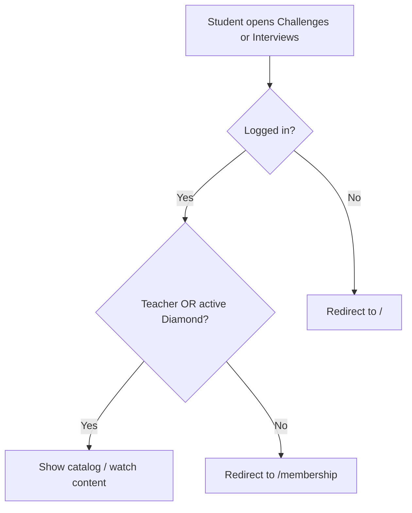

# Diamond Gating for Challenges and Interviews

## Goal

Challenges and Interviews are currently available to **any logged-in user** ([`actions/get-challenge.ts`](actions/get-challenge.ts), [`actions/get-interview.ts`](actions/get-interview.ts)). Mentorship and Seminars already use [`hasGoldOrDiamondAccess`](lib/membership.ts). This change adds a **stricter tier gate**: only `DIAMOND` (plus teachers).

**UX (same as existing premium tabs):** show locked sidebar tabs; clicking a locked tab navigates to the membership page; direct URLs redirect to `/membership`.

## Access model



| User | Challenges / Interviews | Mentorship / Seminars (unchanged) |
|------|-------------------------|-----------------------------------|
| Guest | Redirect `/` | Redirect `/` |
| No membership | Locked tab → `/membership`; direct URL → `/membership` | Same |
| Silver | Same | Locked |
| Gold | Locked | Full access |
| Diamond | Full access | Full access |
| Teacher | Full access | Full access |

## 1. Shared access helper

Add to [`lib/membership.ts`](lib/membership.ts):

```typescript
export async function hasDiamondAccess(userId: string): Promise<boolean> {
  if (isTeacher(userId)) return true;
  const membership = await getActiveMembership(userId);
  return membership?.tier.slug === "DIAMOND";
}
```

Keep `hasGoldOrDiamondAccess` and `hasCourseAccess` unchanged.

## 2. Server route guards (primary enforcement)

Mirror [`app/(root)/(routes)/seminars/page.tsx`](app/(root)/(routes)/seminars/page.tsx):

| File | Change |
|------|--------|
| [`app/(root)/(routes)/challenges/page.tsx`](app/(root)/(routes)/challenges/page.tsx) | After auth, `if (!(await hasDiamondAccess(userId))) redirect("/membership")` |
| [`app/(root)/(routes)/interviews/page.tsx`](app/(root)/(routes)/interviews/page.tsx) | Same |
| [`app/(course)/watch-challenge/layout.tsx`](app/(course)/watch-challenge/layout.tsx) | Same before fetching catalog |
| [`app/(course)/watch-interview/layout.tsx`](app/(course)/watch-interview/layout.tsx) | Same |

## 3. Action-level defense in depth

| File | Current rule | New rule |
|------|--------------|----------|
| [`actions/get-challenge.ts`](actions/get-challenge.ts) | `isPublished && userId` | `hasDiamondAccess(userId)` when published |
| [`actions/get-interview.ts`](actions/get-interview.ts) | `isPublished && userId` | `hasDiamondAccess(userId)` when published |

Catalog list actions ([`get-challenges.ts`](actions/get-challenges.ts), [`get-interviews.ts`](actions/get-interviews.ts)) stay as-is — pages/layouts redirect before rendering.

## 4. Sidebar: locked tabs

Thread a second boolean through the existing layout chain (parallel to `hasGoldOrDiamondAccess`):

```
layout.tsx → RootLayoutSwitch → DashboardLayout → Sidebar / Navbar → MobileSidebar → SidebarRoutes
```

**Files to update:**

- [`app/(root)/layout.tsx`](app/(root)/layout.tsx) — compute `hasDiamondAccess` when `userId` exists
- [`app/(root)/_components/root-layout-switch.tsx`](app/(root)/_components/root-layout-switch.tsx)
- [`app/(root)/_components/dashboard-layout.tsx`](app/(root)/_components/dashboard-layout.tsx)
- [`app/(root)/_components/sidebar.tsx`](app/(root)/_components/sidebar.tsx)
- [`app/(root)/_components/Navbar.tsx`](app/(root)/_components/Navbar.tsx)
- [`app/(root)/_components/MobileSidebar.tsx`](app/(root)/_components/MobileSidebar.tsx)
- [`app/(root)/_components/sidebar-routes.tsx`](app/(root)/_components/sidebar-routes.tsx) — set `locked: !hasDiamondAccess` on **student** Challenges + Interviews items only (teacher routes stay unlocked)

[`sidebar-item.tsx`](app/(root)/_components/sidebar-item.tsx) already redirects locked clicks to `` `/${language.membershipURL}` `` — no change needed.

## 5. Tests

### Gating scenarios — extend [`e2e/student/membership.spec.ts`](e2e/student/membership.spec.ts)

Add a `diamond content gating (challenges and interviews)` describe block:

| Scenario | Expected |
|----------|----------|
| No membership → `/challenges` or `/interviews` | Redirect `/membership` |
| Silver → `/challenges` | Redirect `/membership` |
| Gold → `/challenges` and `/interviews` | Redirect `/membership` |
| Diamond → `/challenges` and `/interviews` | Pages load; fixtures from [`e2e/constants.ts`](e2e/constants.ts) visible |

Reuse helpers from [`e2e/helpers/membership.ts`](e2e/helpers/membership.ts) and fixtures `E2E_PUBLISHED_CHALLENGE`, `E2E_PUBLISHED_INTERVIEW`.

### Existing catalog specs — require Diamond setup

[`e2e/student/challenges.spec.ts`](e2e/student/challenges.spec.ts) and [`e2e/student/interviews.spec.ts`](e2e/student/interviews.spec.ts) currently assume any logged-in student has access. Follow the pattern in [`e2e/student/seminars.spec.ts`](e2e/student/seminars.spec.ts):

- `beforeAll`: read Clerk userId, call `simulateMembershipCheckoutCompleted(userId, "DIAMOND")`
- `afterAll`: `clearMembershipSubscription`
- `test.describe.configure({ mode: "serial" })`

Guest tests in [`e2e/guest/catalog.spec.ts`](e2e/guest/catalog.spec.ts) remain unchanged (still redirect `/`).

## Out of scope

- Teacher admin routes under `/teacher/challenges` and `/teacher/interviews`
- Mentorship/Seminars gating (`hasGoldOrDiamondAccess`) — unchanged
- Course access (`hasCourseAccess`) — any active tier still unlocks paid courses
- Dedicated "upgrade to Diamond" copy — membership page already has upgrade CTAs

## Verification

- Manual: non-member → Challenges/Interviews show lock; click → membership page; direct URL → membership
- Manual: Gold member → Mentorship/Seminars work; Challenges/Interviews still locked
- Manual: Diamond → all four premium tabs unlocked
- Manual: teacher → student tabs unlocked; teacher CRUD unchanged
- Run: `npx playwright test e2e/student/membership.spec.ts e2e/student/challenges.spec.ts e2e/student/interviews.spec.ts`

## Risks

- **Two booleans through layout chain** — mechanical prop drilling; acceptable given existing pattern for `hasGoldOrDiamondAccess`
- **E2E ordering** — `membership.spec.ts` runs serial and clears subscription; new gating tests must set tier explicitly per test (existing pattern)
