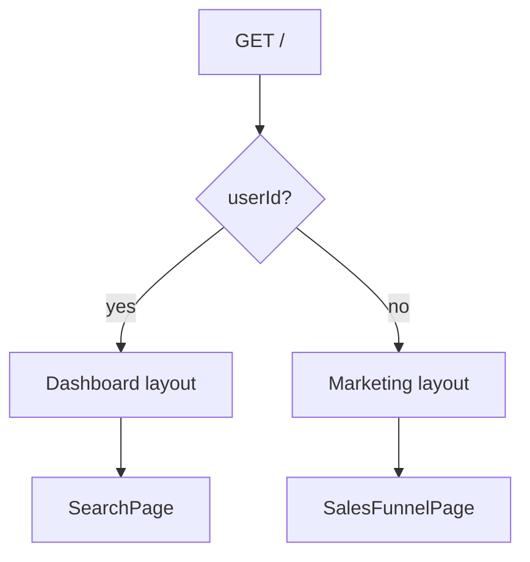

# Auth-based home page

## Current state


| Route                                                                                                | Layout                                    | Content                         |
| ---------------------------------------------------------------------------------------------------- | ----------------------------------------- | ------------------------------- |
| `[app/(root)/page.tsx](app/(root)`/page.tsx)                                                         | Dashboard shell (sidebar + navbar)        | SearchPage (course catalog)     |
| `[app/landing_page/(routes)/sales-funnel/page.tsx](app/landing_page/(routes)`/sales-funnel/page.tsx) | Marketing shell (landing navbar + Nunito) | Sales funnel (client component) |


Both layouts live under different route trees. A single `/` page cannot inherit two layouts, so we need a **conditional layout** only when `pathname === '/'` and the user is a guest.




Other `(root)` routes (e.g. `/courses/[slug]`) should **redirect unauthenticated users back to `/`**. We still should **not** gate the entire `(root)/layout.tsx` on auth alone, because it needs to render the marketing shell for `/`.

## Implementation

### 1. Extract shared page components

- Move SearchPage logic from `[app/(root)/page.tsx](app/(root)`/page.tsx) into `[app/(root)/_components/search-page.tsx](app/(root)`/_components/search-page.tsx) (server component, same props/data fetching as today).
- Rename/move the sales funnel default export from `[app/landing_page/(routes)/sales-funnel/page.tsx](app/landing_page/(routes)`/sales-funnel/page.tsx) to `[app/landing_page/(routes)/sales-funnel/_components/sales-funnel-page.tsx](app/landing_page/(routes)`/sales-funnel/_components/sales-funnel-page.tsx) (keep `"use client"`).

### 2. Auth-conditional home page

Update `[app/(root)/page.tsx](app/(root)`/page.tsx):

```tsx
const { userId } = auth();
if (!userId) return <SalesFunnelPage />;
return <SearchPage searchParams={searchParams} />;
```

Add `generateMetadata()` (server-side) using the same logic currently in `[app/landing_page/(routes)/sales-funnel/layout.tsx](app/landing_page/(routes)`/sales-funnel/layout.tsx) when `!userId`; otherwise fall back to the existing site metadata from `[app/layout.tsx](app/layout.tsx)`.

### 3. Pathname-aware layout switch

Update `[app/(root)/layout.tsx](app/(root)`/layout.tsx) to delegate shell rendering to a small client wrapper, e.g. `[app/(root)/_components/root-layout-switch.tsx](app/(root)`/_components/root-layout-switch.tsx):

- `!userLoggedIn && pathname === '/'` → **marketing shell** (extract from `[app/landing_page/layout.tsx](app/landing_page/layout.tsx)`: landing `Navbar`, `Footer`, Nunito font)
- otherwise → **existing dashboard shell** (sidebar, root `Navbar`, footer)

Extract a reusable `[app/landing_page/_components/marketing-layout.tsx](app/landing_page/_components/marketing-layout.tsx)` so `[app/landing_page/layout.tsx](app/landing_page/layout.tsx)` and the root switch share the same markup (no duplication).

### 4. Gate other (root) routes

- Update `[app/(root)/(routes)/courses/[courseSlug]/page.tsx](app/(root)`/(routes)/courses/[courseSlug]/page.tsx) to:
  - call `auth()`
  - if `!userId`, `return redirect("/")` early (before DB queries)
  - keep the existing `redirect("/")` when the course is missing

This ensures guests can’t view course details or progress UI, matching “other (root) routes should be gated on auth too”.2

### 5. Remove old sales-funnel route

Per your choice: delete route entrypoints so `/landing_page/sales-funnel` returns 404:

- Delete `[app/landing_page/(routes)/sales-funnel/page.tsx](app/landing_page/(routes)`/sales-funnel/page.tsx)
- Delete `[app/landing_page/(routes)/sales-funnel/layout.tsx](app/landing_page/(routes)`/sales-funnel/layout.tsx)
- Keep `_components/` (still used by the new home page)

### 6. Update e2e tests

`[e2e/guest/catalog.spec.ts](e2e/guest/catalog.spec.ts)` should be updated to:

- assert sales-funnel content on `/` (stable `#main-content` works)
- assert that visiting `/courses/${E2E_PUBLISHED_COURSE.slug}` redirects back to `/`

Since guests can’t browse course pages anymore, move the “draft course not shown” assertion to an authenticated context (either:

- add to `[e2e/student/learning.spec.ts](e2e/student/learning.spec.ts)` by visiting `/` and asserting the draft title is absent
or
- adjust/extend an existing student test).

## Files touched


| File                                                                                                                                                   | Change                                |
| ------------------------------------------------------------------------------------------------------------------------------------------------------ | ------------------------------------- |
| `[app/(root)/page.tsx](app/(root)`/page.tsx)                                                                                                           | Auth branch + `generateMetadata`      |
| `[app/(root)/layout.tsx](app/(root)`/layout.tsx)                                                                                                       | Use layout switch wrapper             |
| `[app/(root)/_components/root-layout-switch.tsx](app/(root)`/_components/root-layout-switch.tsx)                                                       | New — pathname + auth shell selection |
| `[app/(root)/_components/search-page.tsx](app/(root)`/_components/search-page.tsx)                                                                     | New — extracted SearchPage            |
| `[app/landing_page/_components/marketing-layout.tsx](app/landing_page/_components/marketing-layout.tsx)`                                               | New — shared marketing shell          |
| `[app/landing_page/layout.tsx](app/landing_page/layout.tsx)`                                                                                           | Delegate to `MarketingLayout`         |
| `[app/landing_page/(routes)/sales-funnel/_components/sales-funnel-page.tsx](app/landing_page/(routes)`/sales-funnel/_components/sales-funnel-page.tsx) | New — moved from `page.tsx`           |
| `sales-funnel/page.tsx`, `sales-funnel/layout.tsx`                                                                                                     | Deleted                               |
| `[app/(root)/(routes)/courses/[courseSlug]/page.tsx](app/(root)`/(routes)/courses/[courseSlug]/page.tsx)                                               | Redirect unauth users to `/`          |
| `[e2e/guest/catalog.spec.ts](e2e/guest/catalog.spec.ts)`                                                                                               | Updated assertions                    |
| `[e2e/student/learning.spec.ts](e2e/student/learning.spec.ts)`                                                                                         | (Optional) Add draft-not-listed check |


## Verification

- Guest `GET /` → sales funnel, marketing navbar, no sidebar
- Authenticated `GET /` → SearchPage, sidebar + search navbar
- Guest `GET /courses/...` (or localized slug) → redirected to `/` (sales funnel)
- `GET /landing_page/sales-funnel` → 404
- `GET /dashboard` unauthenticated → still redirects to `/` (now sales funnel)
- Run e2e guest suite; run student test if added

## Risks / notes

- **Layout flash**: client-side pathname check may cause a brief shell swap on hydration; acceptable for this pattern and consistent with existing client navbars.
- **Sign-out**: `afterSignOutUrl="/"` in `[app/layout.tsx](app/layout.tsx)` already points to `/` — guests will land on the sales funnel after sign-out (desired).
- **No middleware changes needed** — Clerk `auth()` in server components is sufficient.

