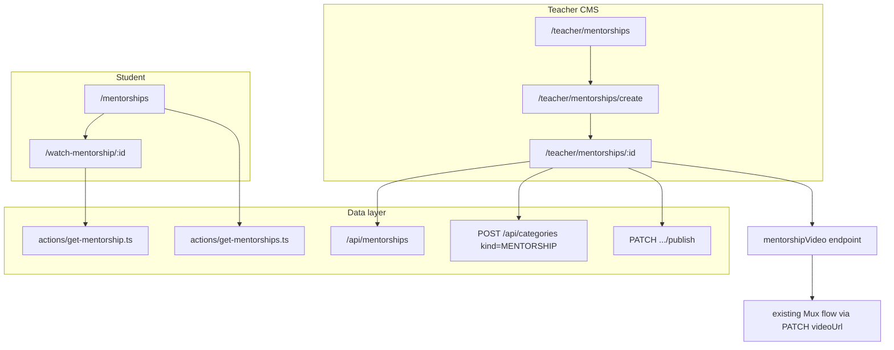

# Mentorship Feature Plan

## Locked product decisions

| Area | Decision |
|------|----------|
| Content unit | Single recorded video per mentorship |
| Access | Free for any logged-in user (no purchase) |
| Differentiation | Minimal seminar clone — different branding/nav only |
| Categories | New `CategoryKind.MENTORSHIP`; teacher creates from setup; **≥1 required to publish** |
| Publish gate | Seminar fields + categories + muxData (6 items total) |
| Teacher preview | Interview style — **no** `isTeacher` bypass on `/watch-mentorship/:id`; Mux preview on setup only |
| URLs | `/mentorships`, `/teacher/mentorships`, `/watch-mentorship/:id` |
| PT rewrites | `mentorias`, `assistir-mentoria` (mirror [`next.config.mjs`](next.config.mjs)) |
| Catalog v1 | Title search only (`?title=`) |
| Watch page | Full shell (navbar + sidebar) + title + category chips + description |
| Teacher table | Seminar columns: title, published, actions |
| Sidebar | After Seminars, before Interviews |
| Implementation | Copy/adapt seminar + interview files (accept v1 duplication) |
| Tests/seed | Mirror interviews: [`e2e/student/interviews.spec.ts`](e2e/student/interviews.spec.ts) + [`scripts/e2e-seed.ts`](scripts/e2e-seed.ts) |

**Out of scope v1:** analytics, category catalog filter, progress tracking, attachments, course/career links, comments.

## Architecture



**Hybrid reference model:**
- **Schema/forms:** seminar-shaped (`title`, `description`, `imageUrl`, `videoUrl`, `muxData`)
- **Categories + publish:** interview-shaped (`categoryIDs`, `CategoryKind.MENTORSHIP`, publish validates ≥1 category)
- **Access:** interview-shaped (`isPublished && userId` only — no teacher bypass in `get-mentorship.ts`)

## 1. Prisma schema

Extend [`prisma/schema.prisma`](prisma/schema.prisma):

```prisma
enum CategoryKind {
  COURSE
  INTERVIEW
  MENTORSHIP   // new
}

model Mentorship {
  id           String   @id @default(auto()) @map("_id") @db.ObjectId
  userId       String
  title        String
  description  String?  @db.String
  imageUrl     String?
  videoUrl     String?  @db.String
  isPublished  Boolean  @default(false)
  categoryIDs  String[] @db.ObjectId
  categories   Category[] @relation(fields: [categoryIDs], references: [id])
  muxData      MuxData?
  createdAt    DateTime @default(now())
  updatedAt    DateTime @updatedAt

  @@map("mentorships")
}

model Category {
  // existing fields...
  mentorshipIDs String[]    @db.ObjectId
  mentorships   Mentorship[] @relation(fields: [mentorshipIDs], references: [id])
}

model MuxData {
  // existing fields...
  mentorshipId String?     @unique @db.ObjectId
  mentorship   Mentorship? @relation(fields: [mentorshipId], references: [id], onDelete: Cascade)
}
```

Run `prisma db push` after schema change.

## 2. API routes

Copy from [`app/api/interviews/`](app/api/interviews/) and strip guest/difficulty logic:

| Route | Behavior |
|-------|----------|
| `POST /api/mentorships` | Teacher-only; create `{ userId, title }` |
| `PATCH /api/mentorships/[id]` | Update fields; on `videoUrl` change → delete old Mux asset, create new, upsert `MuxData` (copy from [`app/api/interviews/[interviewId]/route.ts`](app/api/interviews/[interviewId]/route.ts)) |
| `DELETE /api/mentorships/[id]` | Delete mentorship + Mux cleanup |
| `PATCH /api/mentorships/[id]/publish` | Require title, description, imageUrl, videoUrl, muxData, `categoryIDs.length >= 1`, and ≥1 linked category with `kind: MENTORSHIP` |
| `PATCH /api/mentorships/[id]/unpublish` | Set `isPublished: false` |

Extend [`app/api/categories/route.ts`](app/api/categories/route.ts) POST to accept `kind: MENTORSHIP` (today it only allows `INTERVIEW`):

```typescript
if (!name || ![CategoryKind.INTERVIEW, CategoryKind.MENTORSHIP].includes(kind)) {
  return new NextResponse("Bad Request", { status: 400 });
}
```

Add `mentorshipVideo` to [`app/api/uploadthing/core.ts`](app/api/uploadthing/core.ts) (same limits as `seminarVideo` / `interviewVideo`).

## 3. Server actions

| File | Role |
|------|------|
| `actions/get-mentorships.ts` | Published mentorships; optional `title` filter; `include: { categories: true }`; `orderBy: createdAt desc` |
| `actions/get-mentorship.ts` | Single mentorship + muxData + categories; access: `isPublished && userId` only (**no teacher bypass**) |

## 4. Teacher UI

Copy [`app/(root)/(routes)/teacher/seminars/`](app/(root)/(routes)/teacher/seminars/) + category form from [`interview-categories-form.tsx`](app/(root)/(routes)/teacher/interviews/[interviewId]/_components/interview-categories-form.tsx):

| Route | Notes |
|-------|-------|
| `/teacher/mentorships` | Data table — columns from [`seminars/_components/columns.tsx`](app/(root)/(routes)/teacher/seminars/_components/columns.tsx) |
| `/teacher/mentorships/create` | Title form → `POST /api/mentorships` → redirect to setup |
| `/teacher/mentorships/[mentorshipId]` | Setup with **6-field** completion tracker |

**Setup forms:**
- `MentorshipTitleForm`, `MentorshipDescriptionForm`, `MentorshipImageForm` — copy seminar forms
- `MentorshipCategoriesForm` — copy interview categories form; `kind: MENTORSHIP`; loads categories where `kind: MENTORSHIP`
- `MentorshipVideoForm` — copy seminar/interview video form; use `mentorshipVideo` UploadThing endpoint
- `MentorshipSetupHeader` + `MentorshipActions` — publish disabled until all 6 fields complete

Protected by existing [`app/(root)/(routes)/teacher/layout.tsx`](app/(root)/(routes)/teacher/layout.tsx) (`isTeacher` gate).

## 5. Student UI

| Route | Notes |
|-------|-------|
| `/mentorships` | Copy [`app/(root)/(routes)/seminars/page.tsx`](app/(root)/(routes)/seminars/page.tsx); auth required; `getMentorships` + `SearchInput` + `MentorshipsList` |
| `components/mentorship-card.tsx` | Copy seminar card; link via `language.mentorships.watchMentorshipURL` |
| `components/mentorships-list.tsx` | Grid of cards |

**Watch** — copy [`app/(course)/watch-interview/`](app/(course)/watch-interview/):

| File | Notes |
|------|-------|
| `watch-mentorship/layout.tsx` | Auth guard + `getMentorships` + navbar/sidebar shell |
| `watch-mentorship/[mentorshipId]/page.tsx` | Player + title + **category chips** + description (no guest/difficulty) |
| `watch-mentorship/_components/*` | Navbar, sidebar, sidebar-item, mobile sidebar, video-player |

Redirect to `/mentorships` when `!mentorship || !muxData?.playbackId`.

## 6. Config and i18n

**[`next.config.mjs`](next.config.mjs):**
- Add `mentorships` / `watch-mentorship` to `translations.portuguese` and `translations.english`
- Add `watch-mentorship` to `routesWithDynamicSlug`

**[`app/(root)/_components/sidebar-routes.tsx`](app/(root)/_components/sidebar-routes.tsx):**
- Student routes: insert Mentorship after Seminars
- Teacher routes: same position
- Pick a distinct lucide icon (e.g. `Users` or `GraduationCap`)

**Language files** ([`languages/english.tsx`](languages/english.tsx), [`portuguese.tsx`](languages/portuguese.tsx), [`spanish.tsx`](languages/spanish.tsx), [`french.tsx`](languages/french.tsx), [`language.d.ts`](languages/language.d.ts)):
- `mentorships` (catalog strings + `watchMentorshipURL`)
- `teacherMentorships`, `teacherMentorshipCreate`, `teacherMentorshipSetup`
- Category field strings (can reuse interview category copy with "mentorship" wording)

**[`components/navbar-routes.tsx`](components/navbar-routes.tsx):** Add watch-mentorship path detection (same pattern as interviews).

## 7. E2E and seed

Mirror interviews in [`e2e/constants.ts`](e2e/constants.ts):
- `E2E_PUBLISHED_MENTORSHIP`, `E2E_DRAFT_MENTORSHIP`, `E2E_MENTORSHIP_CATEGORY`, `E2E_PUBLISHED_MENTORSHIP_MUX`
- `watchMentorshipPath(id)` helper

Extend [`scripts/e2e-seed.ts`](scripts/e2e-seed.ts):
- Upsert MENTORSHIP category
- Published mentorship (all fields + fake MuxData)
- Draft mentorship (incomplete / unpublished)

Add [`e2e/student/mentorships.spec.ts`](e2e/student/mentorships.spec.ts):
- Published appears on catalog
- Draft hidden
- Title search works
- Watch page shows title + category chip (not guest)

Optional: [`e2e/teacher/mentorships.spec.ts`](e2e/teacher/mentorships.spec.ts) if teacher e2e exists for interviews.

## 8. File copy map (v1)

Primary sources to adapt (rename interview/seminar → mentorship):

| New area | Primary copy source |
|----------|---------------------|
| Teacher list/create/setup | `teacher/seminars/*` |
| Categories form | `teacher/interviews/.../interview-categories-form.tsx` |
| Publish route | `api/interviews/[id]/publish` (drop guest/difficulty checks) |
| get-mentorship access | `actions/get-interview.ts` |
| Watch layout | `watch-interview/*` |
| Watch page content | `watch-seminar/[id]/page.tsx` + category chips from `watch-interview` |

Estimated new/modified files: ~35–40 (same order of magnitude as interviews feature).

## 9. Verification checklist

- Teacher: create → fill all 6 fields → publish → appears on `/mentorships`
- Student: logged-in catalog + watch; guest redirected from `/mentorships` and watch layout
- Unpublished: teacher cannot watch via `/watch-mentorship/:id` (redirect); can preview on setup
- Category: create from setup; duplicate name returns 409; publish blocked without category
- PT locale: `/mentorias` and `/assistir-mentoria/:id` rewrites work
- `npm run db:e2e:reset` + mentorship e2e specs pass

## Open assumptions (flagged)

- **ASSUMPTION (H):** No guest/difficulty fields ever — if mentorship later needs "mentor profile" metadata, that would be a v2 schema addition.
- **ASSUMPTION (M):** Category chips on catalog cards are deferred (title-only cards like seminars); categories visible on watch page only.
- **ASSUMPTION (H):** `@@unique([name, kind])` on Category already supports a MENTORSHIP taxonomy independent of INTERVIEW names.
