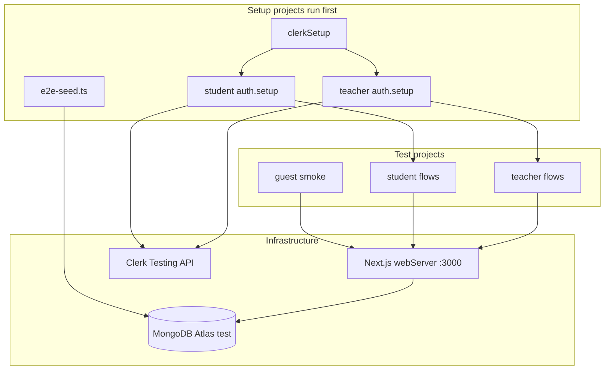

# Playwright E2E Testing Configuration

## Current state

- [`@playwright/test@1.46.1`](package.json) is installed but **no** `playwright.config.ts`, no `e2e/` folder, no npm scripts
- [`.gitignore`](.gitignore) already excludes `test-results/`, `playwright-report/`, `playwright/.cache/`
- Almost no test selectors — only 2 `data-testid` attrs on the landing page ([`hero.tsx`](app/landing_page/_components/hero.tsx), [`career/page.tsx`](app/landing_page/(routes)/career/page.tsx))
- Auth is Clerk-hosted UI at `/sign-in` ([`sign-in/page.tsx`](app/(auth)/(routes)/sign-in/[[...sign-in]]/page.tsx))
- Teacher gate is a single env var check ([`lib/teacher.ts`](lib/teacher.ts))
- URLs are **locale-dependent** via rewrites in [`next.config.mjs`](next.config.mjs) — Portuguese uses `/entrar`, `/cursos`, `/assistir-curso`; English uses `/sign-in`, `/courses`, `/watch-course`

## Architecture



## Key decisions (locked in)

| Decision | Choice | Rationale |
|---|---|---|
| CI target | Local + GitHub Actions | Per your preference |
| Auth | `@clerk/testing` + project-based setup | Official Clerk pattern; avoids brittle UI login in every test |
| Database | Dedicated Atlas test cluster | Per your preference; isolated from dev/prod |
| Locale in tests | `NEXT_PUBLIC_LANGUAGE=english` | Predictable URLs (`/sign-in`, `/courses/...`, `/watch-course/...`) |
| Payments / Mux / UploadThing | **Not** exercised in E2E | Seed `Purchase` records and skip real checkout/video upload; test access-control boundaries instead |

## 1. Dependencies and scripts

**Add:**
- `@clerk/testing` (dev) — Clerk testing tokens + `clerk.signIn()` ([Clerk Playwright docs](https://clerk.com/docs/guides/development/testing/playwright/overview))
- `dotenv` (dev) — load `.env.test` in Playwright config
- `tsx` (dev) — run TypeScript seed script

**Update [`package.json`](package.json) scripts:**
```json
"test:e2e": "playwright test",
"test:e2e:ui": "playwright test --ui",
"test:e2e:debug": "playwright test --debug",
"test:e2e:report": "playwright show-report",
"db:e2e:reset": "prisma db push --force-reset && tsx scripts/e2e-seed.ts"
```

**Optional:** bump `@playwright/test` to latest 1.x (not required for v1).

## 2. Environment files

Create **`.env.test.example`** (committed) documenting all E2E vars. Create **`.env.test`** locally (gitignored via `.env*` rule).

```bash
# App
NODE_ENV=test
NEXT_PUBLIC_APP_URL=http://localhost:3000
NEXT_PUBLIC_LANGUAGE=english

# Clerk (use a dedicated Clerk "Development" instance or test instance)
NEXT_PUBLIC_CLERK_PUBLISHABLE_KEY=
CLERK_SECRET_KEY=
E2E_CLERK_STUDENT_EMAIL=
E2E_CLERK_STUDENT_PASSWORD=
E2E_CLERK_TEACHER_EMAIL=
E2E_CLERK_TEACHER_PASSWORD=

# Teacher gate — must equal the Clerk userId of the teacher test user
NEXT_PUBLIC_TEACHER_ID=

# Atlas test cluster (separate DB name, e.g. programacaocomramon-e2e)
DATABASE_URL=

# Required for Next build/runtime (can be dummy values if tests don't hit these paths)
UPLOADTHING_SECRET=dummy
UPLOADTHING_APP_ID=dummy
MUX_TOKEN_ID=dummy
MUX_TOKEN_SECRET=dummy
STRIPE_API_KEY_DEV=sk_test_dummy
STRIPE_API_KEY_PROD=sk_test_dummy
STRIPE_WEBHOOK_SECRET=whsec_dummy
MP_ACCESS_TOKEN=dummy
```

**Clerk setup (manual, one-time):**
1. Create two test users in Clerk Dashboard: `student@...` and `teacher@...`
2. Copy the teacher user's Clerk `userId` into `NEXT_PUBLIC_TEACHER_ID`
3. Enable [Clerk testing tokens](https://clerk.com/docs/guides/development/testing/overview) for the instance

**Atlas setup (one-time):**
- Create a separate database (e.g. `programacaocomramon-e2e`) on Atlas
- Use its connection string as `DATABASE_URL` in `.env.test` and GitHub secret `E2E_DATABASE_URL`

## 3. Playwright config

Create [`playwright.config.ts`](playwright.config.ts) at repo root:

- Load `.env.test` via `dotenv` at top of config
- `testDir: './e2e'`
- `baseURL: process.env.NEXT_PUBLIC_APP_URL`
- `fullyParallel: true` for guest tests; `workers: 1` in CI if DB seed races become an issue
- `retries: process.env.CI ? 2 : 0`
- `reporter: [['html'], ['github']]` in CI
- `trace: 'on-first-retry'`, `screenshot: 'only-on-failure'`
- **`webServer`** (critical for CI):
  ```ts
  webServer: {
    command: 'npm run build && npm run start',
    url: 'http://localhost:3000',
    reuseExistingServer: !process.env.CI,
    timeout: 180_000,
    env: { /* pass through from process.env */ },
  }
  ```
  Locally you can run `npm run dev` separately and rely on `reuseExistingServer: true` for faster iteration.

**Project structure** (Clerk-recommended project dependencies, not function-based `globalSetup`):

| Project | Purpose | `storageState` |
|---|---|---|
| `setup` | `clerkSetup()` + DB seed | — |
| `auth-student` | `clerk.signIn()` student, save state | writes `playwright/.auth/student.json` |
| `auth-teacher` | `clerk.signIn()` teacher, save state | writes `playwright/.auth/teacher.json` |
| `guest` | Unauthenticated smoke | none |
| `student` | Authenticated student flows | `playwright/.auth/student.json` |
| `teacher` | Teacher CMS flows | `playwright/.auth/teacher.json` |

Add `playwright/.auth/` to [`.gitignore`](.gitignore).

## 4. E2E seed data

Create [`scripts/e2e-seed.ts`](scripts/e2e-seed.ts) — deterministic fixtures with **stable slugs/IDs** exported as constants (e.g. `e2e/constants.ts`) so tests don't scrape the DOM for IDs.

**Seed content (minimum viable):**

| Entity | Purpose |
|---|---|
| Categories | 2–3 (from existing [`scripts/seed.ts`](scripts/seed.ts) pattern) |
| Course A — `e2e-published-course` | Published, priced, 2 published chapters (ch1 free, ch2 paid), fake `imageUrl`, no real Mux |
| Course B — `e2e-draft-course` | Unpublished (verify not on catalog) |
| Purchase | For student Clerk user on Course A (created after auth setup knows `userId`, or use a fixed test user ID) |

**Purchase seeding strategy:** run a small helper in `auth-student` setup *after* `clerk.signIn()` that upserts a `Purchase` for the signed-in `userId` + seeded course ID. This avoids hardcoding Clerk user IDs in the seed script.

**Reset strategy for CI:** `prisma db push --force-reset` then seed at start of `setup` project. Atlas test DB is disposable by design.

## 5. Auth setup files

Create:
- [`e2e/setup/global.setup.ts`](e2e/setup/global.setup.ts) — `clerkSetup()`, reset+seed DB
- [`e2e/setup/auth-student.setup.ts`](e2e/setup/auth-student.setup.ts) — sign in student, seed purchase, verify `/dashboard` loads, save `storageState`
- [`e2e/setup/auth-teacher.setup.ts`](e2e/setup/auth-teacher.setup.ts) — sign in teacher, verify `/teacher/courses` loads, save `storageState`

Use Clerk's server-side `clerk.signIn({ page, signInParams: { strategy: 'password', identifier, password } })` per [authenticated flows guide](https://clerk.com/docs/guides/development/testing/playwright/test-authenticated-flows).

## 6. Initial test suite (P0)

### Guest — [`e2e/guest/catalog.spec.ts`](e2e/guest/catalog.spec.ts)
- `/` renders published course card for `e2e-published-course`
- Unpublished course not visible
- `/dashboard` redirects to `/` (or sign-in)
- `/teacher/courses` redirects non-teacher away

### Student — [`e2e/student/learning.spec.ts`](e2e/student/learning.spec.ts)
- `/dashboard` shows in-progress course
- `/courses/e2e-published-course` shows progress bar
- Free chapter: navigate to watch URL, see chapter title (no Mux playback assertion)
- Paid chapter without purchase: see enroll/lock UI (purchase seeded in setup → should see player container or chapter content)
- Toggle chapter complete → refresh → progress updates on dashboard

### Teacher — [`e2e/teacher/access.spec.ts`](e2e/teacher/access.spec.ts)
- `/teacher/courses` lists teacher's courses
- `/teacher/create` form renders
- Non-teacher project is NOT run here; guest test covers the redirect

### Explicitly deferred (document in `e2e/README.md`)
- Stripe / Mercado Pago checkout UI and webhooks
- Mux video playback (requires real asset)
- UploadThing file uploads
- Drag-and-drop chapter reorder
- Landing page marketing routes (low ROI initially)

## 7. Selector strategy

Prefer **role-based** selectors first (`getByRole`, `getByLabel`). Add **`data-testid` sparingly** only where Clerk/Mux/Radix make roles unreliable:

| Component | Suggested `data-testid` |
|---|---|
| [`CourseCard`](components/course-card.tsx) | `course-card-{slug}` |
| [`CoursesList`](components/courses-list.tsx) empty state | `courses-list-empty` |
| Chapter progress button | `chapter-progress-toggle` |
| Course enroll buttons | `enroll-stripe`, `enroll-mercado-pago` (for future payment tests) |

Keep Portuguese copy out of selectors — use `data-testid` or roles, not translated text.

## 8. GitHub Actions workflow

Create [`.github/workflows/e2e.yml`](.github/workflows/e2e.yml):

```yaml
on: [pull_request]
jobs:
  e2e:
    runs-on: ubuntu-latest
    timeout-minutes: 30
    steps:
      - uses: actions/checkout@v4
      - uses: actions/setup-node@v4
        with: { node-version: 20, cache: npm }
      - run: npm ci
      - run: npx playwright install --with-deps chromium
      - run: npm run test:e2e
        env:
          DATABASE_URL: ${{ secrets.E2E_DATABASE_URL }}
          CLERK_SECRET_KEY: ${{ secrets.E2E_CLERK_SECRET_KEY }}
          NEXT_PUBLIC_CLERK_PUBLISHABLE_KEY: ${{ secrets.E2E_CLERK_PUBLISHABLE_KEY }}
          # ... remaining vars from secrets or inline dummy values
      - uses: actions/upload-artifact@v4
        if: failure()
        with: { name: playwright-report, path: playwright-report/ }
```

**GitHub secrets to create:** `E2E_DATABASE_URL`, `E2E_CLERK_SECRET_KEY`, `E2E_CLERK_PUBLISHABLE_KEY`, `E2E_CLERK_STUDENT_EMAIL`, `E2E_CLERK_STUDENT_PASSWORD`, `E2E_CLERK_TEACHER_EMAIL`, `E2E_CLERK_TEACHER_PASSWORD`, `E2E_TEACHER_ID`

Start with **Chromium only** in CI to keep runs fast; add `firefox`/`webkit` projects later if needed.

## 9. Known issues tests may surface

- Landing page redirects logged-in users to `/courses` ([`landing_page/page.tsx`](app/landing_page/page.tsx)) but the catalog lives at `/` — may 404 depending on locale. E2E with `english` locale is a good regression catch.
- Progress API ([`progress/route.ts`](app/api/courses/[courseId]/chapters/[chapterId]/progress/route.ts)) does not verify purchase — worth a separate security test later, not blocking initial setup.

## 10. Local dev workflow

```bash
cp .env.test.example .env.test   # fill in values
npm run db:e2e:reset             # reset Atlas test DB + seed
npm run test:e2e:ui              # interactive debugging
npm run test:e2e                 # headless full run
```

## File tree (new)

```
playwright.config.ts
e2e/
  constants.ts
  README.md
  setup/
    global.setup.ts
    auth-student.setup.ts
    auth-teacher.setup.ts
  guest/
    catalog.spec.ts
  student/
    learning.spec.ts
  teacher/
    access.spec.ts
scripts/
  e2e-seed.ts
.env.test.example
.github/workflows/e2e.yml
```

## Risks and mitigations

| Risk | Mitigation |
|---|---|
| Atlas latency / flakiness | `retries: 2` in CI; `workers: 1` for DB-mutating tests |
| Clerk testing token expiry | Project-based `clerkSetup()` refreshes per run |
| Build time in CI (~2–3 min) | Acceptable for PR gate; cache `.next` later if slow |
| Teacher `userId` drift | Document one-time setup; fail setup loudly if teacher cannot access `/teacher` |
| Dummy Stripe/Mux keys break build | Provide valid-format dummy keys; only routes that call external APIs need real test keys |

## Verification checklist (definition of done)

- [ ] `npm run test:e2e` passes locally against Atlas test DB
- [ ] GitHub Actions workflow passes on a test PR
- [ ] Guest, student, and teacher projects all green
- [ ] HTML report artifact uploaded on CI failure
- [ ] `.env.test.example` documents every required variable
