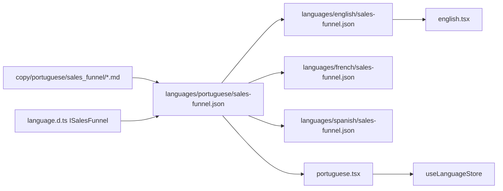

# Sales Funnel Language Store (Step 1)

## Goal

Turn [`copy/portuguese/sales_funnel/01.md`–`06.md`](copy/portuguese/sales_funnel/) into typed, section-based content exposed as `salesFunnel` on [`ILanguage`](languages/language.d.ts), loaded from per-language JSON files and available through the existing Zustand store ([`hooks/use-language-store.ts`](hooks/use-language-store.ts)).

Step 2 (landing page UI) is out of scope for this plan.

## Architecture



**Naming:** Use `salesFunnel` (camelCase) on `ILanguage` to match existing keys like `careersPage` and `homepage`, not `sales_funnel`.

## Section model (maps 6 markdown files to typed properties)

The six source files become **five top-level page sections** (03 + 04 merge into one mastermind block) plus shared reusable types:

| Property | Source | Purpose |
|---|---|---|
| `landing` | `01.md` | Hero, highlights, Platinum/Diamond tiers, value-prop blocks |
| `curriculum` | `02.md` | Module catalog, bonus modules, lesson previews |
| `mastermind` | `03.md` + `04.md` | Sessions 1–62 + Friday Success Coach block |
| `community` | `05.md` | Student-area contributions + Diamond-only mentoring |
| `closing` | `06.md` | eBooks, instructor bio, testimonials, pricing recap, FAQ |

### Core types to add in [`languages/language.d.ts`](languages/language.d.ts)

```typescript
type ISalesFunnel = {
  landing: ISalesFunnelLanding;
  curriculum: ISalesFunnelCurriculum;
  mastermind: ISalesFunnelMastermind;
  community: ISalesFunnelCommunity;
  closing: ISalesFunnelClosing;
};

type ISalesFunnelTier = {
  name: string;
  price: string;
  tagline?: string;
  features: string[];
  newFeatures?: string[];
  exclusiveAccess?: string[];
};

type ISalesFunnelSession = {
  number: number;
  duration: string;
  topics: string[];
};

type ISalesFunnelModule = {
  title: string;
  description?: string;
  bullets?: string[];
};

type ISalesFunnelTestimonial = {
  name: string;
  role?: string;
  quote?: string;
  outcome?: string;
};

type ISalesFunnelFaq = {
  question: string;
  answer: string;
};
```

Nested section shapes (abbreviated):

- **`ISalesFunnelLanding`**: `presenter`, `headline`, `tagline`, `highlights[]`, `techStackHeading`, `ctaHeading`, `tiers: { platinum, diamond }`, `sections[]` (training, mentoring, community, coaches, discord, income CTA — each with `heading` + optional `body` / `bullets`)
- **`ISalesFunnelCurriculum`**: `heading`, `subtitle`, `updateNote`, `modules[]`, `lessonPreviews[]`
- **`ISalesFunnelMastermind`**: `heading`, `description`, `stats`, `sessions[]`, `successCoaches: { heading, schedule, topics[] }`
- **`ISalesFunnelCommunity`**: `studentArea: { heading, description, items[] }`, `diamondMentoring: { heading, description, sessions[] }`
- **`ISalesFunnelClosing`**: `ebooks`, `instructor`, `results`, `pricing: { platinum, diamond }`, `faq[]`, `finalCta`

Add to `ILanguage`:

```typescript
salesFunnel: ISalesFunnel;
```

All content fields are `string` / `string[]` only (no `React.ReactNode`), so JSON stays portable and the future landing page can render markup in components.

## JSON files (one per language)

Create:

- [`languages/portuguese/sales-funnel.json`](languages/portuguese/sales-funnel.json) — converted from existing markdown
- [`languages/english/sales-funnel.json`](languages/english/sales-funnel.json) — translated
- [`languages/french/sales-funnel.json`](languages/french/sales-funnel.json) — translated
- [`languages/spanish/sales-funnel.json`](languages/spanish/sales-funnel.json) — translated

`tsconfig.json` already has `resolveJsonModule: true`, so each `*.tsx` language file can import its JSON directly:

```typescript
import salesFunnel from "./portuguese/sales-funnel.json";

export const portugueseLanguage: ILanguage = {
  // ...existing fields
  salesFunnel,
};
```

Repeat the same import pattern in [`languages/english.tsx`](languages/english.tsx), [`languages/french.tsx`](languages/french.tsx), and [`languages/spanish.tsx`](languages/spanish.tsx).

## Conversion rules (markdown → JSON)

When structuring Portuguese content from the six files:

1. **Strip presentation-only markdown** (horizontal rules, stray `*`, emoji kept as plain text where they carry meaning).
2. **Normalize lists** — every `*` bullet becomes a `string` in `bullets`, `highlights`, `features`, or `topics`.
3. **Preserve hierarchy** — `#` → section `heading`, `##` → subsection / module `title`, `###` → tier name or lesson preview title.
4. **Sessions** — each “Sessão de Mentoria N” / “Mentoria Diamond N” becomes `{ number, duration, topics }`; parse duration from lines like `🕜 3 horas e 48 minutos`.
5. **Pricing** — keep `£597` / `£997` as strings in `price`; do not hard-code currency logic yet.
6. **Do not invent content** — only restructure what exists in the markdown; translation step rewrites strings, not structure.
7. **Completeness** — include all 62 mastermind sessions, all Diamond sessions (note: source `05.md` skips Diamond 28), all FAQ entries, and all curriculum modules.

## Translation approach (en / fr / es)

- Use Portuguese JSON as the **canonical schema and key order** for all languages.
- Translate string values only; keep identical object keys and array lengths.
- Adapt locale-appropriate names where needed (e.g. instructor references may stay “Sonny” / “PAPAFAM” as proper nouns).
- Keep prices in GBP (`£`) unless product decision says otherwise — same as source copy.

## Files to change

| File | Change |
|---|---|
| [`languages/language.d.ts`](languages/language.d.ts) | Add `ISalesFunnel` + nested types; extend `ILanguage` |
| `languages/{pt,en,fr,es}/sales-funnel.json` | New structured content (4 files) |
| [`languages/portuguese.tsx`](languages/portuguese.tsx) | Import JSON, add `salesFunnel` |
| [`languages/english.tsx`](languages/english.tsx) | Import JSON, add `salesFunnel` |
| [`languages/french.tsx`](languages/french.tsx) | Import JSON, add `salesFunnel` |
| [`languages/spanish.tsx`](languages/spanish.tsx) | Import JSON, add `salesFunnel` |

No changes required to [`hooks/use-language-store.ts`](hooks/use-language-store.ts) or [`lib/serverSideLanguage.ts`](lib/serverSideLanguage.ts) — they already expose the full `ILanguage` object.

## Verification

1. `npx tsc --noEmit` — all four language objects satisfy `ILanguage` with `salesFunnel`.
2. Spot-check JSON parity across languages: same number of sessions, modules, FAQ items, and tier fields.
3. Optional lightweight script or test: assert `salesFunnel.mastermind.sessions.length === 62` and FAQ count matches source `06.md`.

## Risks and notes

- **Volume:** ~62 + 32 mentoring sessions and long module lists make large JSON files; keeping them in separate JSON (not inline in `.tsx`) avoids bloating language components.
- **Source gap:** Diamond session 28 is missing in `05.md`; JSON should mirror source (no invented session).
- **Brand mismatch:** Source copy references Sonny/PAPAFAM; your site brand is Ramon/Escola de Programação — acceptable for step 1 as structured copy storage; rebranding can be a follow-up content pass before UI ships.

## Next step (not in this plan)

Build `app/landing_page/(routes)/sales-funnel/page.tsx` (or similar) that reads `useLanguageStore((s) => s.salesFunnel)` and renders section components for `landing`, `curriculum`, `mastermind`, `community`, and `closing`.
