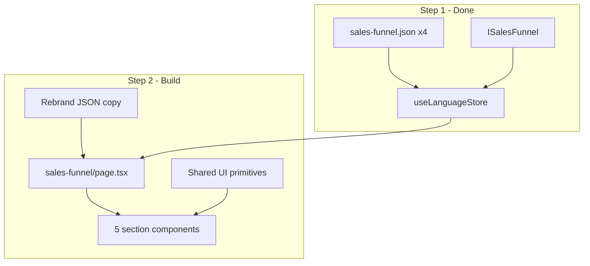
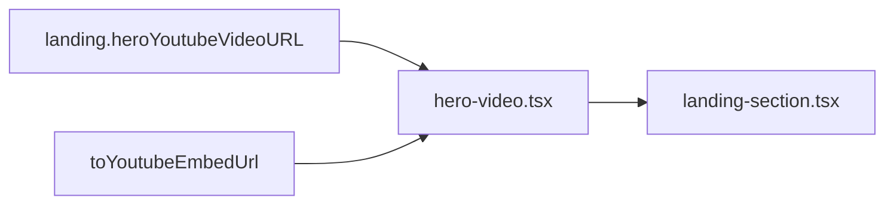
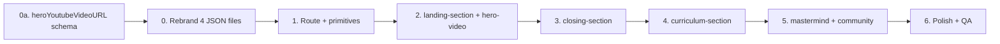

# Sales Funnel Landing Page (Step 2)

## Current state

Step 1 is **done**:

- Types in [`languages/language.d.ts`](languages/language.d.ts) (`ISalesFunnel` + five nested sections)
- JSON in [`languages/{pt,en,fr,es}/sales-funnel.json`](languages/portuguese/sales-funnel.json) (identical structure: 62 mastermind sessions, 31 diamond sessions, 20 modules, 6 FAQs)
- Wired into all four [`languages/*.tsx`](languages/portuguese.tsx) files and exposed via [`hooks/use-language-store.ts`](hooks/use-language-store.ts)

**Nothing consumes `salesFunnel` in `app/` or `components/` yet.**



---

## Phase 0a — Add `heroYoutubeVideoURL` to landing schema

Add a required string field on `ISalesFunnelLanding` so the hero video is content-driven (not env-based like the homepage).

### Type change — [`languages/language.d.ts`](languages/language.d.ts)

```typescript
type ISalesFunnelLanding = {
  presenter: string;
  headline: string;
  tagline: string;
  heroYoutubeVideoURL: string; // new — full YouTube URL or youtu.be link
  highlights: string[];
  // ...rest unchanged
};
```

### JSON — all four `languages/*/sales-funnel.json`

Add `heroYoutubeVideoURL` inside `landing`, immediately after `tagline` (keeps hero fields grouped). Same URL across all languages unless locale-specific videos are needed later.

**Value source:** not in source markdown (`01.md` has no video link). Provide the URL at implementation time (e.g. a Ramon/Escola promo video). Placeholder until then: reuse the homepage video ID from `NEXT_PUBLIC_LANDING_PAGE_VIDEO_URL` if one exists, formatted as `https://www.youtube.com/watch?v={id}`.

### Converter — [`scripts/convert-sales-funnel-pt.ts`](scripts/convert-sales-funnel-pt.ts)

Add `heroYoutubeVideoURL` to the PT JSON output (constant at top of script or read from env during conversion). Keeps markdown pipeline in sync if PT is regenerated.

### UI consumption

- New `hero-video.tsx` primitive under `sales-funnel/_components/`
- Placed at the **top of `landing-section.tsx`** — first visual the user sees (above highlights and tier cards)
- Layout: two-column hero on `md+` (copy left, video right), matching [`hero.tsx`](app/landing_page/_components/hero.tsx)
- Reuse [`SimpleModal`](components/modals/simple-modal.tsx) + thumbnail + Play icon pattern from homepage, **or** inline `aspect-video` iframe if you prefer no click-to-play gate
- Small util `toYoutubeEmbedUrl(url: string)` normalizes `watch?v=`, `youtu.be/`, and `embed/` forms to `https://www.youtube.com/embed/{id}`



---

## Phase 0 — Rebrand copy (before UI)

Per your choice: update content **before** building components.

**Source of truth options:**

| Approach | Pros |
|----------|------|
| Edit [`copy/portuguese/sales_funnel/*.md`](copy/portuguese/sales_funnel/) then re-run [`scripts/convert-sales-funnel-pt.ts`](scripts/convert-sales-funnel-pt.ts) | Keeps markdown ↔ JSON pipeline alive |
| Edit JSON directly in all 4 langs | Faster if structure is stable |

**Replacement map (apply consistently in PT, then mirror in EN/FR/ES):**

| Source term | Target (from existing site copy in [`languages/portuguese.tsx`](languages/portuguese.tsx)) |
|-------------|-------------------------------------------------------------------------------------------|
| Sonny / Sonny Sangha | Ramon Rodrigues |
| PAPAFAM | Escola de Programação (or "comunidade Escola de Programação" where grammar requires) |
| Zero to Full Stack Hero 2.0 | Keep or adapt to your product name — **confirm one product title** and use it everywhere |

~25 `Sonny`/`PAPAFAM` hits in PT JSON today; instructor block in `closing.instructor` also needs `name`/`alias` updated.

**Verification after rebrand:**

- `npx tsc --noEmit`
- Grep all four JSON files: no stray `Sonny` / `PAPAFAM` (unless intentionally kept as historical quote in a testimonial)
- Array lengths unchanged (62 / 31 / 20 / 6)

---

## Phase 1 — Route scaffold and shared primitives

### Route

Create [`app/landing_page/(routes)/sales-funnel/page.tsx`](app/landing_page/(routes)/sales-funnel/page.tsx):

- `"use client"` (matches [`subscription/page.tsx`](app/landing_page/(routes)/subscription/page.tsx) and career pages)
- Inherits [`app/landing_page/layout.tsx`](app/landing_page/layout.tsx) (Navbar + Footer)
- URL: **`/landing_page/sales-funnel`**
- Destructure once: `const { landing, curriculum, mastermind, community, closing } = useLanguageStore().salesFunnel`
- Render five sections in source order (maps to original `01.md`–`06.md` flow)

### Shared components (`_components/`)

| Component | Purpose | Reuse from |
|-----------|---------|------------|
| `multi-line-text.tsx` | Split `string` on `\n` into paragraphs | New (all funnel fields are plain strings) |
| `section-heading.tsx` | Centered h2 + optional subtitle | [`(info)/about`](app/(info)/about/page.tsx) heading pattern |
| `tier-card.tsx` | Platinum/Diamond pricing card | [`subscription/page.tsx`](app/landing_page/(routes)/subscription/page.tsx) card layout |
| `session-accordion.tsx` | Collapsible session with `number`, `duration`, `topics[]` | shadcn `Accordion` (subscription + FAQs) |
| `faq-section.tsx` | Renders `ISalesFunnelFaq` (supports `answer: string \| string[]`, `bullets`, `subsections`) | [`(info)/faqs/page.tsx`](app/(info)/faqs/page.tsx) |
| `hero-video.tsx` | Above-the-fold YouTube embed from `landing.heroYoutubeVideoURL` | [`hero.tsx`](app/landing_page/_components/hero.tsx) thumbnail + modal pattern |

### CTA behavior (UI-only)

- Primary buttons: `href="/sign-up"` (same pattern as [`career/[courseSlug]/page.tsx`](app/landing_page/(routes)/career/[courseSlug]/page.tsx))
- Secondary: `href="#pricing"` / `href="#faq"` in-page anchors
- No Stripe/API calls in v1

---

## Phase 2 — Five section components

Create under `app/landing_page/(routes)/sales-funnel/_components/`:

### 1. `landing-section.tsx` — `salesFunnel.landing`

- Hero (above the fold): `heroYoutubeVideoURL` via `hero-video.tsx` — **first visual on the page**
- Copy block: `presenter`, `headline`, `tagline`, `highlights[]`
- Tech stack heading block
- Side-by-side **tier cards** (`tiers.platinum`, `tiers.diamond`) with `features`, `newFeatures`, `exclusiveAccess`
- Six value-prop blocks from `sections.{training,mentoring,community,coaches,discord,income}`
- Bottom `ctaHeading` + sign-up button

### 2. `curriculum-section.tsx` — `salesFunnel.curriculum`

- `heading`, `subtitle`, `updateNote`
- Module list: each `ISalesFunnelModule` → title, description, optional bullets
- Lesson previews: `previewHeading`, `previewIntro`, `lessonPreviews[]`

### 3. `mastermind-section.tsx` — `salesFunnel.mastermind`

- Intro: `description[]`, `stats` (hours / value / availability / recordingNote)
- **62 sessions** — render via `session-accordion`, grouped (e.g. sessions 1–10, 11–20, …) to avoid 62 open panels
- `expansionCallout` if present
- `successCoaches` block (heading, schedule, topics, footer)

**Performance:** collapsed accordions by default; optional `content-visibility: auto` on session groups (per Vercel React best practices for long lists).

### 4. `community-section.tsx` — `salesFunnel.community`

- `studentArea`: description paragraphs + `items[]` (title, bullets, duration)
- `diamondMentoring`: description + **31 sessions** (same accordion pattern; note Diamond #28 is intentionally absent per source)

### 5. `closing-section.tsx` — `salesFunnel.closing`

- `ebooks` block
- `instructor` bio (post-rebrand: Ramon)
- `results.testimonials[]` — adapt existing [`testimonial.tsx`](app/landing_page/_components/testimonial.tsx) or inline cards
- `pricing` recap (`id="pricing"`) — second tier comparison
- `faq[]` via `faq-section` (`id="faq"`)
- `finalCta.heading` + sign-up button

---

## Phase 3 — Polish and verification

| Task | Detail |
|------|--------|
| Metadata | Add `export const metadata` in a thin server wrapper or a `layout.tsx` for the route with title/description from language (use [`lib/serverSideLanguage.ts`](lib/serverSideLanguage.ts) on server) |
| Responsive QA | Match existing padding: `p-2 md:px-10 lg:px-14` / `px-5 md:px-10 lg:px-20` |
| Accessibility | Accordion keyboard nav; heading hierarchy h1 → h2 → h3 |
| Visual evidence | Screenshots at mobile / tablet / desktop before calling done |
| Typecheck | `npx tsc --noEmit` |
| Optional guard | Lightweight script asserting session/module/FAQ counts across langs |

**Known pre-existing issue (out of scope):** navbar/hero links use `/career` and `/subscription` but real routes are `/landing_page/career` and `/landing_page/subscription`. Fix separately or add rewrites in [`next.config.mjs`](next.config.mjs) when cross-linking from the funnel.

---

## Suggested implementation order (vertical slices)



Build **landing + closing** first — they contain hero, tiers, pricing, FAQ, and CTAs (the highest-value above-the-fold and conversion blocks). Curriculum and session-heavy sections can follow.

---

## Explicitly out of scope (v1)

- Stripe checkout for £597 / £997 (existing [`app/api/courses/[courseId]/checkout/route.ts`](app/api/courses/[courseId]/checkout/route.ts) uses BRL course prices — separate product decision)
- Runtime locale switching (build-time `NEXT_PUBLIC_LANGUAGE` only)
- Automated EN/FR/ES conversion scripts (only PT converter exists)

---

## Files to create / change

| File | Action |
|------|--------|
| [`languages/language.d.ts`](languages/language.d.ts) | Add `heroYoutubeVideoURL: string` to `ISalesFunnelLanding` |
| `languages/*/sales-funnel.json` | Add `landing.heroYoutubeVideoURL` (same URL in all 4 langs) |
| [`scripts/convert-sales-funnel-pt.ts`](scripts/convert-sales-funnel-pt.ts) | Emit `heroYoutubeVideoURL` when regenerating PT JSON |
| `copy/portuguese/sales_funnel/*.md` or `languages/*/sales-funnel.json` | Rebrand strings |
| `app/landing_page/(routes)/sales-funnel/page.tsx` | New orchestrator |
| `app/landing_page/(routes)/sales-funnel/_components/*.tsx` | ~11 section + primitive components (includes `hero-video.tsx`) |
| `app/landing_page/(routes)/sales-funnel/layout.tsx` | Optional metadata only |

No changes needed to [`hooks/use-language-store.ts`](hooks/use-language-store.ts) — it already exposes the full `ILanguage` object.
