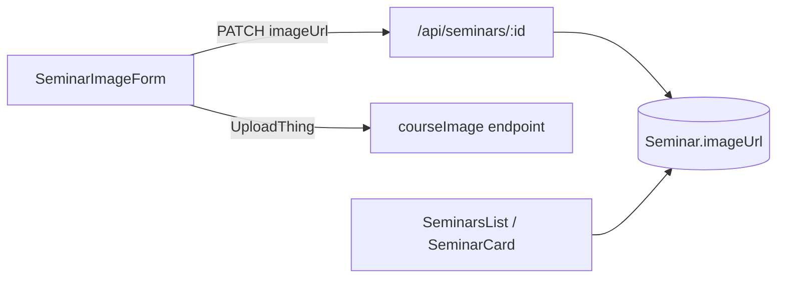

# Seminar image thumbnail

## Context

Course already implements the full pattern we will mirror:

- Schema: [`imageUrl String?`](prisma/schema.prisma) on `Course`
- Upload: [`courseImage`](app/api/uploadthing/core.ts) UploadThing route (teacher-only, 4MB image)
- Teacher form: [`ImageForm`](app/(root)/(routes)/teacher/courses/[courseId]/_components/image-form.tsx) — toggle edit, `FileUpload`, PATCH `/api/courses/:id`
- Publish gate: [`publish/route.ts`](app/api/courses/[courseId]/publish/route.ts) rejects when `!course.imageUrl`
- Student list: [`CourseCard`](components/course-card.tsx) renders `aspect-video` thumbnail via `next/image`

Seminar PATCH already spreads `{ ...values }` into Prisma — no API shape change needed beyond the schema field.



## Changes

### 1. Schema

In [`prisma/schema.prisma`](prisma/schema.prisma), add to `Seminar`:

```prisma
imageUrl String?
```

Then run `npx prisma generate` and `npx prisma db push` to sync MongoDB.

### 2. Teacher setup — image upload form

Create [`app/(root)/(routes)/teacher/seminars/[seminarId]/_components/seminar-image-form.tsx`](app/(root)/(routes)/teacher/seminars/[seminarId]/_components/seminar-image-form.tsx) by adapting [`image-form.tsx`](app/(root)/(routes)/teacher/courses/[courseId]/_components/image-form.tsx):

- Props: `initialData: Seminar`, `seminarId: string`
- PATCH `/api/seminars/${seminarId}` with `{ imageUrl: url }`
- Reuse existing UploadThing endpoint **`courseImage`** (same config; avoids duplicating upload router)
- Use new `teacherSeminarSetup.seminarImageField` language keys (not course copy)

Wire into [`seminar-setup-content.tsx`](app/(root)/(routes)/teacher/seminars/[seminarId]/_components/seminar-setup-content.tsx) in the left column, after `SeminarDescriptionForm` (same order as Course: title → description → image).

### 3. Publish gate + completion counter

**Setup page** [`teacher/seminars/[seminarId]/page.tsx`](app/(root)/(routes)/teacher/seminars/[seminarId]/page.tsx) — add `seminar.imageUrl` to `requiredFields` (5 fields total).

**Publish API** [`app/api/seminars/[seminarId]/publish/route.ts`](app/api/seminars/[seminarId]/publish/route.ts) — add `!seminar.imageUrl` to the missing-fields check (alongside title, description, videoUrl, muxData).

### 4. Student catalog — thumbnail

**[`components/seminar-card.tsx`](components/seminar-card.tsx)**

- Add `imageUrl: string | null` prop
- Add top `aspect-video` block with `next/image` (match [`course-card.tsx`](components/course-card.tsx) layout: image above text, `object-cover`, rounded top)
- Fallback placeholder (slate background + icon) when `imageUrl` is null — covers legacy rows before backfill

**[`components/seminars-list.tsx`](components/seminars-list.tsx)** — pass `imageUrl={item.imageUrl}` to `SeminarCard`.

No change needed to [`actions/get-seminars.ts`](actions/get-seminars.ts) — it returns full `Seminar` rows; `imageUrl` will be included automatically after schema update.

### 5. i18n

Add `seminarImageField` to `teacherSeminarSetup` in all four language files and types:

| File | Change |
|------|--------|
| [`languages/language.d.ts`](languages/language.d.ts) | Add `ILanguageTeacherSeminarSetupImage` type + field on `ILanguageTeacherSeminarSetup` |
| [`languages/english.tsx`](languages/english.tsx) | `seminarImage`, `addAnImage`, `editImage`, `aspectRatioRecommended`, `imageIsNecessary` |
| [`languages/portuguese.tsx`](languages/portuguese.tsx) | Same keys, PT copy |
| [`languages/spanish.tsx`](languages/spanish.tsx) | Same keys, ES copy |
| [`languages/french.tsx`](languages/french.tsx) | Same keys, FR copy |

Mirror wording from existing `courseImageField` entries, adjusted to "seminar".

### 6. E2E seed (forward-looking)

No Playwright seminar specs exist today, but seed data should include `imageUrl` so future seminar e2e tests can rely on a complete published fixture (mirroring course seeds).

**[`e2e/constants.ts`](e2e/constants.ts)**

- Add `E2E_SEMINAR_IDS` and `E2E_PUBLISHED_SEMINAR` with stable ObjectId, title, description, `imageUrl: E2E_FIXTURE_IMAGE_URL` (reuse existing allowlisted placeholder)
- Optional: `E2E_DRAFT_SEMINAR` (unpublished, with `imageUrl` for setup-form testing)
- Add helper paths if useful (e.g. `watchSeminarPath(seminarId)`)

**[`scripts/e2e-seed.ts`](scripts/e2e-seed.ts)**

- Add `seedSeminar(teacherId)` — upsert a **draft** seminar with `imageUrl` and other text fields (no `MuxData`; publish gate still requires video)
- Wire into main seed flow alongside existing course/category seeds

No Playwright specs consume this yet; the fixture keeps seed data aligned with the schema for when seminar e2e is added.

## Explicit decisions

### UploadThing — reuse `courseImage`, no `seminarImage` route

Do **not** add a new `seminarImage` entry to [`app/api/uploadthing/core.ts`](app/api/uploadthing/core.ts). The existing `courseImage` route (teacher-only, 4MB image) is identical in config; `SeminarImageForm` passes `endpoint="courseImage"` to [`FileUpload`](components/file-upload.tsx). Symmetry with `seminarVideo` is not worth duplicating upload router config.

### Teacher data table — no thumbnail column

Leave [`app/(root)/(routes)/teacher/seminars/_components/columns.tsx`](app/(root)/(routes)/teacher/seminars/_components/columns.tsx) unchanged: title, published status, and actions only. Prisma `Seminar` type picks up `imageUrl` automatically; no list thumbnail or image column in the teacher table.

## Out of scope

- Watch-seminar player page thumbnail
- Playwright seminar e2e specs (seed only; tests deferred)

## Verification

1. `npx prisma generate && npx prisma db push`
2. `npm run build` (or `tsc --noEmit`) — Prisma types propagate to components
3. Manual:
   - Teacher: open `/teacher/seminars/:id`, upload image, confirm preview + PATCH persists on refresh
   - Completion counter shows `(5/5)` only when image + other fields present
   - Publish blocked without image; succeeds with image
   - Student `/seminars` list shows thumbnail on cards

## Risks

- **Existing published seminars** without `imageUrl` will fail re-publish until image is uploaded; catalog cards show placeholder until backfilled (acceptable transition).
