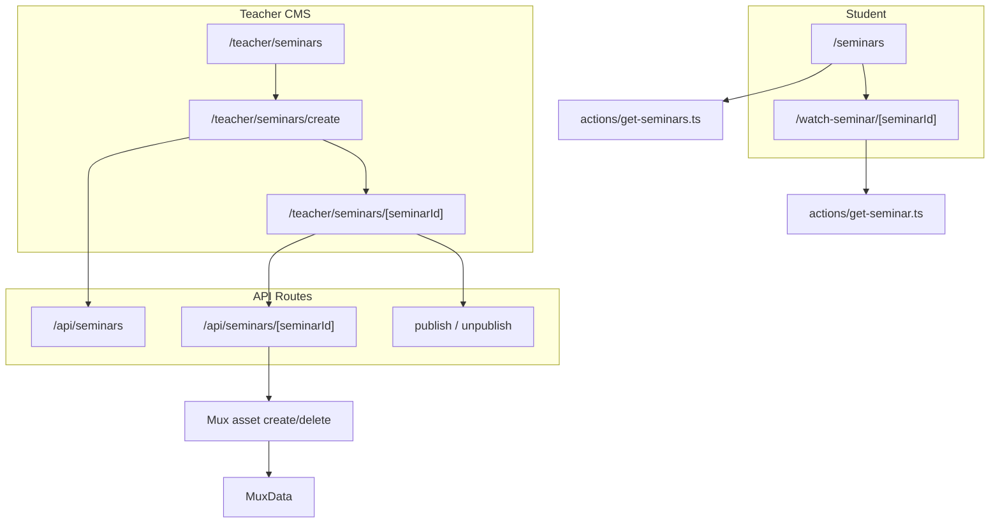

# Seminars Feature Plan

## Scope (confirmed)

- **Teacher:** list, create, setup/edit, publish/unpublish/delete, video upload via Mux — mirroring the courses/chapters pattern.
- **Student:** catalog at `/seminars` + single-video watch page; **free for logged-in users** (no purchase/checkout in v1).
- **Out of scope:** pricing, `SeminarPurchase`, Stripe/Mercado Pago checkout, progress tracking.

---

## Architecture



---

## 1. Prisma schema

**File:** [`prisma/schema.prisma`](prisma/schema.prisma)

Add `Seminar` model with the fields you specified, plus two implementation-necessary fields not in your list:

| Field | Why |
|-------|-----|
| `userId` | Teacher ownership checks on all mutations (same as `Course.userId`) |
| `videoUrl` | UploadThing URL that triggers Mux asset creation on PATCH (same as `Chapter.videoUrl`) |

```prisma
model Seminar {
  id          String   @id @default(auto()) @map("_id") @db.ObjectId
  userId      String
  title       String
  description String?  @db.String
  videoUrl    String?  @db.String
  isPublished Boolean  @default(false)
  muxData     MuxData?
  createdAt   DateTime @default(now())
  updatedAt   DateTime @updatedAt
  @@map("seminars")
}
```

**Extend `MuxData`** — today it is 1:1 with `Chapter` via required `chapterId`. Make `chapterId` optional and add optional `seminarId` so one row links to either a chapter or a seminar (never both; enforced in API code):

```prisma
model MuxData {
  // existing assetId, playbackId
  chapterId String?  @unique @db.ObjectId
  chapter   Chapter? @relation(...)
  seminarId String?  @unique @db.ObjectId
  seminar   Seminar? @relation(fields: [seminarId], references: [id], onDelete: Cascade)
}
```

After schema edit: `npx prisma generate` + `npx prisma db push`.

---

## 2. Teacher navigation

**File:** [`app/(root)/_components/sidebar-routes.tsx`](app/(root)/_components/sidebar-routes.tsx)

Add a third teacher route between Courses and Analytics:

```ts
{ icon: School, label: language.seminars, href: "/teacher/seminars", locked: false }
```

(`School` is already imported but unused.)

---

## 3. Teacher pages (mirror courses pattern)

All under `app/(root)/(routes)/teacher/`, gated by existing [`teacher/layout.tsx`](app/(root)/(routes)/teacher/layout.tsx) (`isTeacher()`).

| Route | Pattern source | Purpose |
|-------|----------------|---------|
| `seminars/page.tsx` | [`courses/page.tsx`](app/(root)/(routes)/teacher/courses/page.tsx) | RSC: `db.seminar.findMany({ where: { userId }, orderBy: { createdAt: "desc" } })` |
| `seminars/_components/data-table.tsx` | [`courses/_components/data-table.tsx`](app/(root)/(routes)/teacher/courses/_components/data-table.tsx) | Filter by title, "New Seminar" → `/teacher/seminars/create` |
| `seminars/_components/columns.tsx` | [`courses/_components/columns.tsx`](app/(root)/(routes)/teacher/courses/_components/columns.tsx) | Columns: **title**, **published badge**, **edit** → `/teacher/seminars/[id]` (no price column) |
| `seminars/create/page.tsx` | [`create/page.tsx`](app/(root)/(routes)/teacher/create/page.tsx) | Title-only form → `POST /api/seminars` → redirect to setup page |
| `seminars/[seminarId]/page.tsx` | Chapter setup (simpler) | Single-page setup: title, description, video, publish actions |
| `seminars/[seminarId]/_components/` | Chapter/course forms | `seminar-setup-header.tsx`, `actions.tsx`, `title-form.tsx`, `description-form.tsx`, `video-form.tsx` |

**Setup page layout:** one column (or two-column like chapter setup) with inline-edit cards — same axios + `router.refresh()` pattern as existing `*-form.tsx` components.

**Publish gate** (mirror [`chapters/.../publish/route.ts`](app/api/courses/[courseId]/chapters/[chapterId]/publish/route.ts)): require `title`, `description`, `videoUrl`, and a `MuxData` row before publish.

**Video form:** adapt [`chapter-video-form.tsx`](app/(root)/(routes)/teacher/courses/[courseId]/chapters/[chapterId]/_components/chapter-video-form.tsx) — `FileUpload` endpoint + `MuxPlayer` preview; PATCH sends `{ videoUrl }`.

---

## 4. API routes

New handlers under `app/api/seminars/`, following existing course/chapter auth:

- `auth()` + `isTeacher(userId)` on all mutations
- Ownership: `seminar.userId === userId`

| Method | Path | Behavior |
|--------|------|----------|
| POST | `/api/seminars` | Create `{ userId, title }` |
| PATCH | `/api/seminars/[seminarId]` | Update title/description/videoUrl; on `videoUrl` change, run Mux create/delete logic (copy from [`chapters/[chapterId]/route.ts`](app/api/courses/[courseId]/chapters/[chapterId]/route.ts) using `seminarId`) |
| DELETE | `/api/seminars/[seminarId]` | Delete Mux asset + `MuxData`, then seminar |
| PATCH | `/api/seminars/[seminarId]/publish` | Validate completeness, set `isPublished: true` |
| PATCH | `/api/seminars/[seminarId]/unpublish` | Set `isPublished: false` |

---

## 5. UploadThing

**File:** [`app/api/uploadthing/core.ts`](app/api/uploadthing/core.ts)

Add `seminarVideo` route (same config as `chapterVideo`, teacher-gated) to keep endpoints semantically clear. `video-form.tsx` uses endpoint `"seminarVideo"`.

---

## 6. Student-facing pages

### Catalog — `/seminars`

| File | Role |
|------|------|
| `app/(root)/(routes)/seminars/page.tsx` | Requires auth (`redirect("/")` if no `userId`, matching course detail) |
| `actions/get-seminars.ts` | `db.seminar.findMany({ where: { isPublished: true }, orderBy: { createdAt: "desc" } })` |
| `components/seminar-card.tsx` | Card linking to watch page; show title + description excerpt |
| `components/seminars-list.tsx` | Grid wrapper (mirror [`courses-list.tsx`](components/courses-list.tsx)) |

Optional: title search via `?title=` query param (same pattern as homepage).

### Watch — `/watch-seminar/[seminarId]`

Simpler than the course watch flow — **no chapter sidebar**.

| File | Role |
|------|------|
| `app/(course)/watch-seminar/[seminarId]/page.tsx` | Single Mux player page |
| `app/(course)/watch-seminar/[seminarId]/_components/video-player.tsx` | Reuse or thin-wrap existing [`video-player.tsx`](app/(course)/watch-course/[courseId]/chapters/[chapterId]/_components/video-player.tsx) without progress/next-chapter logic |
| `actions/get-seminar.ts` | Load seminar + `muxData`; access rules below |

**Access rules (v1):**

```
canWatch = seminar.isPublished && (userId || isTeacher(userId))
```

- Logged-in user + published → return `muxData.playbackId`
- Unauthenticated → redirect to `/` (or `/sign-in` — match course detail behavior: redirect `/`)
- Unpublished → teachers only via `isTeacher()`
- No purchase/free/lock UI needed in v1

### Student sidebar

**File:** [`sidebar-routes.tsx`](app/(root)/_components/sidebar-routes.tsx)

Uncomment and enable the existing stub:

```ts
{ icon: School, label: language.seminars, href: "/seminars", locked: false }
```

### URL rewrites (optional, follow courses pattern)

**File:** [`next.config.mjs`](next.config.mjs)

Add PT rewrite for `/seminarios` → `/seminars` and `/assistir-seminario/:id` → `/watch-seminar/:id` if i18n URL parity is desired (can defer).

---

## 7. Internationalization

**Files:** [`languages/english.tsx`](languages/english.tsx), [`portuguese.tsx`](languages/portuguese.tsx), [`spanish.tsx`](languages/spanish.tsx), [`french.tsx`](languages/french.tsx), [`language.d.ts`](languages/language.d.ts)

Add sections mirroring existing teacher keys:

- `sidebar.seminars`
- `teacherSeminars` — list table strings (`filterSeminars`, `newSeminar`, reuse `title`/`published`/`draft`/`edit` where possible)
- `teacherSeminarCreate` — create page copy
- `teacherSeminarSetup` — setup page + form labels (adapt from `teacherCourseChapterSetup`)
- `seminars` — student catalog empty state, card CTA ("Watch")

Do not hardcode UI strings in new components.

---

## 8. Documentation update

Update [`/.cursor/skills/lms-domain/SKILL.md`](.cursor/skills/lms-domain/SKILL.md) with `Seminar` model, routes, and access rules so future work stays consistent.

---

## Implementation order

Recommended vertical slices for reviewable PRs:

1. **Schema + MuxData extension** — foundation; verify existing chapter Mux flows still work after `chapterId` becomes optional.
2. **Teacher list + create + API POST** — navigation tab, table, create redirect.
3. **Teacher setup + Mux pipeline + publish/delete API** — full CMS.
4. **Student catalog + watch + get-seminar action** — enable sidebar link.

---

## Verification

| Check | Command / action |
|-------|------------------|
| Schema sync | `npx prisma generate && npx prisma db push` |
| Typecheck | `npx tsc --noEmit` or project lint script |
| Teacher flow | Create seminar → add description → upload video → publish → appears in list |
| Mux cleanup | Delete seminar → Mux asset removed |
| Student flow | Logged-in user sees published seminar in `/seminars` → plays at `/watch-seminar/[id]` |
| Regression | Existing course/chapter video upload and publish still work |
| Auth | Non-teacher blocked from `/teacher/seminars` and API mutations |

**Not verified in v1:** payment flows, progress tracking, SEO metadata, PT URL rewrites.

---

## Risks and assumptions

| Item | Confidence | Risk if wrong |
|------|------------|---------------|
| Seminars are free for logged-in users | **H** (user confirmed) | Would need `price` + purchase model later |
| `userId` + `videoUrl` added to Seminar | **H** (required by existing patterns) | API/Mux pipeline cannot work without them |
| `MuxData.chapterId` made optional | **M** | Must regression-test all chapter Mux queries; no DB rows should have both IDs |
| No `slug` on Seminar | **M** | Watch URL uses `[seminarId]` ObjectId; acceptable for v1, less SEO-friendly |
| Student catalog requires login | **M** (matches course detail) | Product may later want public browse |
